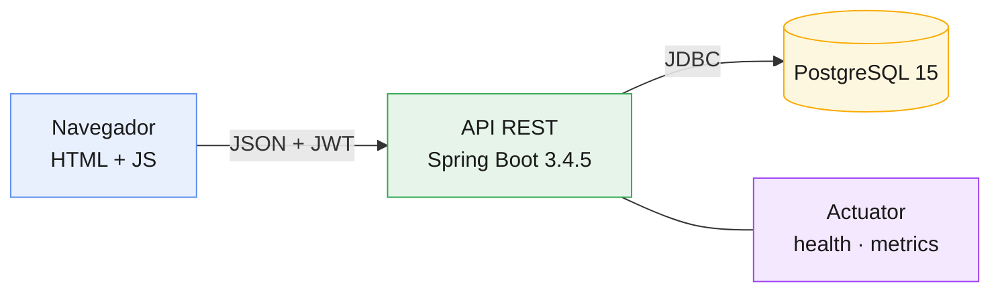
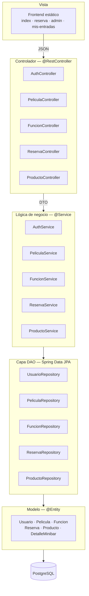
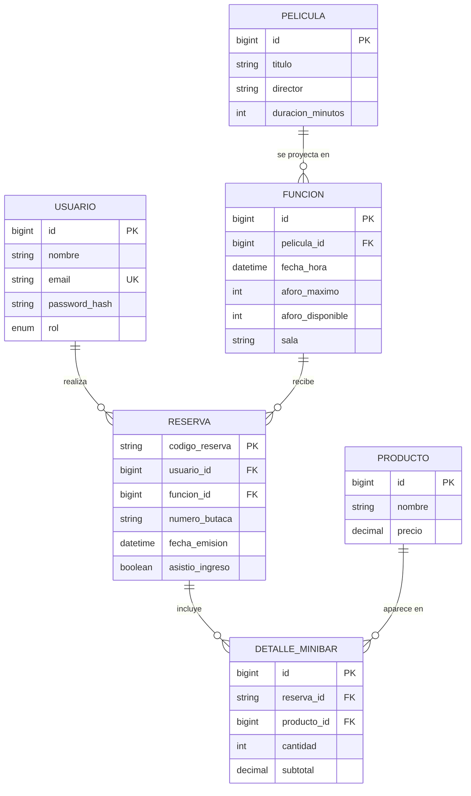
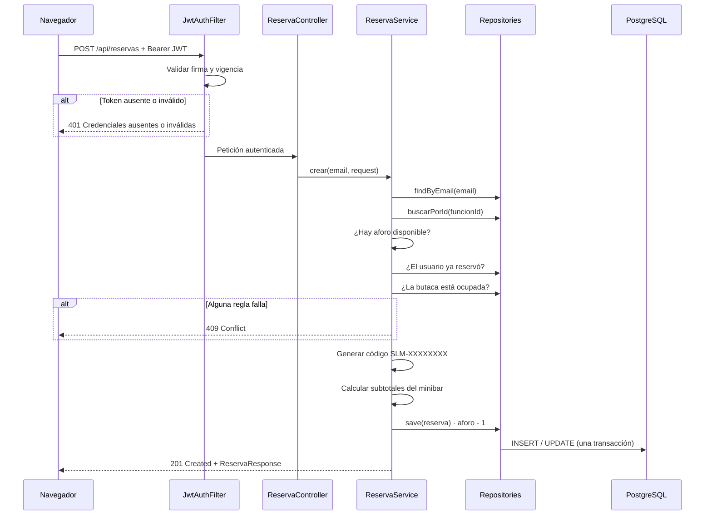
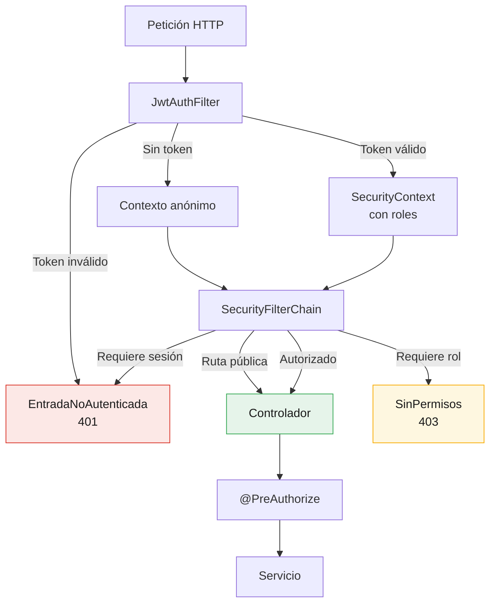
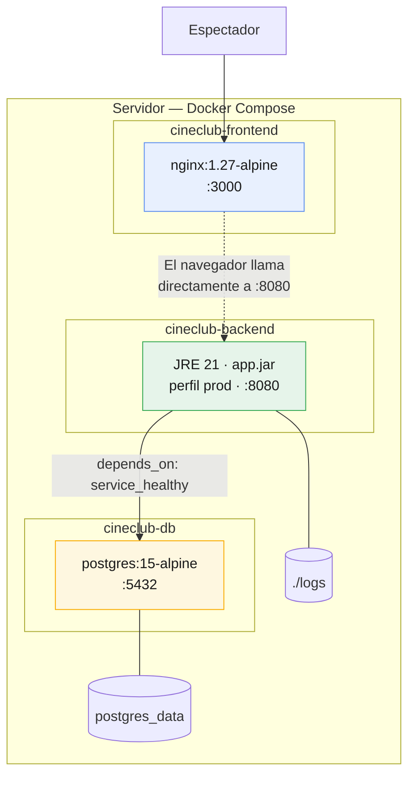

# Arquitectura del sistema

Proyecto CineClub Salamanca — UTP, Curso Integrador I: Sistemas Software.

Este documento describe la estructura MVC, la capa DAO y cómo se aplican los principios
SOLID en el código.

## 1. Visión general

La aplicación tiene tres partes: un frontend estático, una API REST y una base de datos.

La API no guarda sesión (`SessionCreationPolicy.STATELESS`). La identidad viaja en un token
JWT en cada petición, así que el backend se puede reiniciar sin que nadie pierda la sesión.

## 2. Capas

El backend está separado en capas, y cada una solo depende de la siguiente. Entre el
controlador y la vista se usan DTO, no entidades JPA.

Usamos DTO en la frontera HTTP por dos motivos. El primero es de seguridad: los `record` de
`dto/` definen exactamente qué sale, y así `JwtResponse` no puede filtrar el `passwordHash`.
El segundo es práctico: si serializáramos las entidades directamente, Jackson intentaría
recorrer las relaciones `LAZY` de JPA y saltaría `LazyInitializationException`. La
conversión está en los métodos `from(...)` de cada DTO de respuesta.

### Paquetes

| Capa MVC | Paquete | Responsabilidad |
|---|---|---|
| Vista | `frontend/` | Interfaz; consume la API con `fetch` |
| Controlador | `controller/` | Rutas HTTP, códigos de estado, autorización |
| — | `dto/` | Entrada y salida de la API |
| Modelo (negocio) | `service/` | Reglas del dominio y transacciones |
| Modelo (datos) | `repository/` | Capa DAO |
| Modelo (dominio) | `entity/` | Entidades JPA |
| Transversal | `security/`, `config/` | JWT, filtros, CORS, errores |
| Transversal | `monitoring/`, `maintenance/` | Sondas, métricas y tareas programadas |

## 3. Modelo de datos

Hay dos cosas del modelo que conviene aclarar:

La clave primaria de `RESERVA` es el `codigo_reserva` (`SLM-` más 8 caracteres) y no un id
autonumérico. Como ese código es el que el espectador muestra en la puerta, lo usamos
directamente como identificador en vez de arrastrar una columna extra.

`aforo_disponible` está denormalizado. Se podría calcular contando reservas, pero lo
guardamos para no repetir esa cuenta cada vez que alguien abre la cartelera. A cambio, el
contador se puede desincronizar, y por eso existe la auditoría semanal que describe el
[plan de mantenimiento](PLAN_MANTENIMIENTO.md).

## 4. Flujo de una reserva

El método `crear` es `@Transactional`, así que si falla el descuento del aforo tampoco se
guarda la reserva.

## 5. Principios SOLID

| Principio | Dónde se ve |
|---|---|
| Responsabilidad única | Cada capa cambia por un solo motivo. `MetricasNegocio` publica la telemetría con un `MeterBinder` en lugar de meter contadores dentro de `ReservaService`, para que las reglas de negocio no se toquen al cambiar el monitoreo. |
| Abierto/cerrado | Para añadir una sonda basta crear un `HealthIndicator`: Actuator la recoge sin modificar nada existente. Igual con un `MeterBinder` o un `@ExceptionHandler`. |
| Sustitución de Liskov | `UserDetailsServiceImpl` cumple el contrato de `UserDetailsService` y Spring Security lo usa sin conocer la implementación. Lo mismo con `EntradaNoAutenticada` y `SinPermisos`, que reemplazan a los manejadores por defecto. |
| Segregación de interfaces | Los repositorios declaran solo los métodos que hacen falta. Los DTO son interfaces estrechas: `PeliculaRequest` no trae campos que el cliente no deba mandar. |
| Inversión de dependencias | Los servicios dependen de interfaces `Repository`, no de `EntityManager`. La inyección es por constructor con campos `final`, lo que además permite instanciarlos con mocks en las pruebas. |

## 6. Seguridad

La autorización está en dos sitios: por ruta en `SecurityConfig` y por método con
`@PreAuthorize`. Es redundante a propósito. Si mañana alguien agrega una ruta y se olvida de
cubrirla en la cadena de filtros, la anotación del método todavía protege la operación.

Para que la API distinga 401 de 403 hubo que configurar un `AuthenticationEntryPoint`
propio, porque Spring Security responde 403 en los dos casos. Está explicado en el
[informe de seguridad](INFORME_SEGURIDAD.md).

## 7. Despliegue

nginx solo sirve los archivos estáticos, no hace de proxy inverso. El navegador arma la URL
de la API con el host desde el que cargó la página (ver `api.js`), así que el backend
necesita tener publicado el puerto 8080. El procedimiento completo está en el
[plan de despliegue](PLAN_DESPLIEGUE.md).

## Documentos relacionados

- [Informe de pruebas de software](INFORME_PRUEBAS.md)
- [Informe de pruebas de seguridad](INFORME_SEGURIDAD.md)
- [Plan de despliegue](PLAN_DESPLIEGUE.md)
- [Plan de monitoreo](PLAN_MONITOREO.md)
- [Plan de mantenimiento](PLAN_MANTENIMIENTO.md)
- [Referencias](REFERENCIAS.md)
