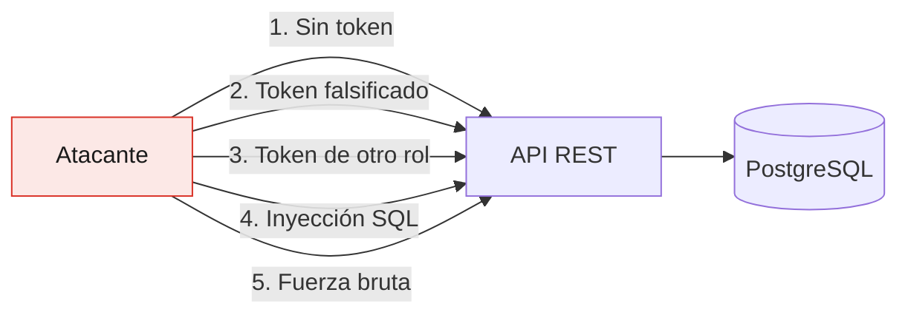

# Informe de pruebas de seguridad

Proyecto CineClub Salamanca — UTP, Curso Integrador I: Sistemas Software.

## 1. Conceptos

Las pruebas de seguridad verifican que el sistema protege la confidencialidad, la integridad
y la disponibilidad de los datos ante un uso malintencionado. Se diferencian de las
funcionales en la intención: la prueba funcional comprueba que el sistema hace lo que debe,
y la de seguridad que no hace lo que no debe.

### Enfoques

| Enfoque | Qué es | Cómo se aplica acá |
|---|---|---|
| SAST | Análisis estático, sin ejecutar | Revisión manual de la configuración de seguridad y avisos del compilador |
| SCA | Búsqueda de CVE en librerías de terceros | OWASP Dependency-Check (perfil `seguridad`) |
| DAST | Análisis con la aplicación corriendo | `SeguridadIntegrationTest`: peticiones reales contra la cadena de filtros |

### Herramientas

| Herramienta | Para qué |
|---|---|
| OWASP Dependency-Check 10.0.4 | Dependencias con vulnerabilidades publicadas (NVD) |
| Spring Security Test | Pruebas de autenticación y autorización |
| MockMvc | Envío de peticiones maliciosas simuladas |
| BCrypt | Verificación del cifrado de contraseñas |

## 2. Superficie analizada



Revisamos los riesgos del OWASP Top 10 que aplican a una API REST de este alcance.

## 3. Pruebas ejecutadas

Las 16 pruebas de `SeguridadIntegrationTest` corren en cada `mvnw test`. No son una
auditoría de una sola vez: quedan como regresión, así que si alguien reabre uno de estos
huecos la build falla.

### 3.1 Control de acceso (A01)

| # | Prueba | Esperado | Resultado |
|---|---|---|---|
| 1 | Endpoint protegido sin token | 401 | Pasa |
| 2 | Token con firma inválida | 401 | Pasa |
| 3 | Usuario autenticado accede a sus reservas | 200 | Pasa |
| 4 | Usuario sin rol admin lista reservas de una función | 403 | Pasa |
| 5 | Administrador lista reservas de una función | 200 | Pasa |
| 6 | Usuario sin rol admin crea películas | 403 | Pasa |
| 7 | Cartelera pública sin autenticar | 200 | Pasa |
| 8 | Métricas de Actuator sin token | 401 | Pasa |
| 9 | Sonda de salud pública | 200 | Pasa |
| 10 | Sonda de salud no expone componentes al anónimo | sin `components` | Pasa |

La prueba 2 manda un token bien formado pero firmado con otra clave. Sirve para confirmar
que se valida la firma y no solo el formato: un JWT mal implementado que únicamente
decodifique el payload aceptaría cualquier identidad que el atacante escriba ahí.

### 3.2 Fallos criptográficos (A02)

| # | Prueba | Esperado | Resultado |
|---|---|---|---|
| 11 | La contraseña se guarda cifrada con BCrypt | hash `$2...`, nunca texto plano | Pasa |
| 12 | La respuesta de login no expone el hash | sin `passwordHash` ni `$2a$` | Pasa |

BCrypt es un hash adaptativo y con sal. Tiene un factor de coste que lo hace lento a
propósito, lo que encarece los ataques de diccionario, y la sal viene incluida en el propio
hash, así que no se pueden precomputar tablas arcoíris. No es reversible:
`passwordEncoder.matches()` vuelve a hashear el intento y compara, no descifra nada.

### 3.3 Inyección (A03)

| # | Prueba | Esperado | Resultado |
|---|---|---|---|
| 13 | Payload `' OR '1'='1'; DROP TABLE usuario; --` en el login | 4xx, base intacta | Pasa |

La prueba cuenta los usuarios antes y después: la tabla sigue ahí con el mismo contenido. La
protección no viene de filtrar caracteres raros, sino de que JPA parametriza las consultas,
con lo que el texto viaja como valor de un parámetro y nunca como parte de la sentencia SQL.
El intento se trata como un email cualquiera que no existe.

La única consulta JPQL escrita a mano también usa parámetros con nombre:

```java
@Query("SELECT r.numeroButaca FROM Reserva r WHERE r.funcion.id = :funcionId")
List<String> findButacasOcupadasByFuncionId(Long funcionId);
```

### 3.4 Validación de entrada

| # | Prueba | Esperado | Resultado |
|---|---|---|---|
| 14 | Registro con contraseña de 3 caracteres | 400, usuario no creado | Pasa |
| 15 | Registro con email de formato inválido | 400 | Pasa |
| 16 | Login con contraseña incorrecta | 401 | Pasa |

## 4. Observaciones levantadas

### OBS-01: la API no distinguía 401 de 403 (severidad media, corregida)

Las pruebas 1, 2, 8 y 16 fallaron la primera vez que se corrieron: la API devolvía 403
donde correspondía 401.

```
SeguridadIntegrationTest.endpointProtegido_debeRechazarSinToken:82
    Status expected:<401> but was:<403>
SeguridadIntegrationTest.login_debeRechazarPasswordIncorrecta:169
    Status expected:<401> but was:<403>
```

**Causa.** Dos defectos distintos con el mismo síntoma. Por un lado, `SecurityConfig` no
declaraba un `AuthenticationEntryPoint`, y como tampoco se usa `formLogin` ni `httpBasic`,
Spring Security aplica `Http403ForbiddenEntryPoint` y responde 403 a todo rechazo, incluido
el del usuario anónimo. Por otro, `GlobalExceptionHandler` no manejaba
`AuthenticationException`, así que un login con credenciales incorrectas caía en esa misma
ruta.

**Impacto.** El cliente no podía diferenciar "se venció tu sesión, volvé a entrar" de "tu
sesión sirve pero no te alcanza el rol". El frontend no tenía cómo decidir si mandar al
login, y un token vencido se le mostraba al usuario como si fuera un problema de permisos.
Además se aparta de la semántica HTTP del RFC 9110 §15.5.2.

**Corrección.** Se agregaron `EntradaNoAutenticada` (401) y `SinPermisos` (403), ambos con
cuerpo JSON del mismo formato, registrados en `SecurityConfig` con `exceptionHandling`. Y
`GlobalExceptionHandler` ahora maneja `AuthenticationException` como 401.

**Verificación.** Las 16 pruebas pasan. Los mensajes quedaron genéricos ("Credenciales
ausentes o inválidas") para no revelar si un correo está registrado.

### OBS-02: una cartelera vacía tumbaba la sonda de salud (severidad media, corregida)

La prueba 9 falló: `GET /actuator/health` devolvía 503.

```
SeguridadIntegrationTest.health_debeSerPublico:149
    Status expected:<200> but was:<503>
```

**Causa.** `CarteleraHealthIndicator` reportaba `DOWN` cuando no había funciones futuras, y
Actuator traduce `DOWN` a HTTP 503.

**Impacto.** Un problema de disponibilidad que nos íbamos a causar solos: con la aplicación
perfectamente sana, si el administrador no programaba funciones el balanceador habría sacado
la instancia de rotación y Docker habría reiniciado el contenedor en ciclo. Estábamos
tratando una condición de negocio como si fuera una falla de infraestructura.

**Corrección.** El indicador usa ahora un estado propio, `SIN_CARTELERA`, en lugar de
`DOWN`. Actuator solo mapea a 503 los estados `DOWN` y `OUT_OF_SERVICE`; los demás se sirven
con 200 y pesan menos al agregar, así que el aviso queda visible en el detalle sin bajar la
salud global. Si falla de verdad la consulta a la base, ahí sí sigue reportando `DOWN`.

**Verificación.** `/actuator/health` responde 200 con `status: UP`, y la cartelera vacía
aparece como `SIN_CARTELERA` en el detalle, que solo ven los administradores.

### OBS-03: secreto JWT por defecto débil (severidad alta, mitigada, requiere acción al desplegar)

`application.properties` define `app.jwt.secret=${JWT_SECRET:change_me_in_production}`, y el
`.env` de desarrollo trae `change_me_in_production_cineclub_salamanca_secret_key`.

**Impacto.** Cualquiera que conozca el secreto puede firmar tokens válidos para el usuario
que quiera, administrador incluido. Como el valor está en un repositorio, un despliegue que
arranque sin definir `JWT_SECRET` queda comprometido desde el primer minuto.

**Estado.** En desarrollo el riesgo es aceptable porque el dato no vale nada. En producción
no lo es.

**Mitigación aplicada.** El perfil `prod` toma `JWT_SECRET` de una variable de entorno, sin
valor por defecto. El `.env` está en `.gitignore` y nunca se versionó (comprobado con
`git ls-files`). El `.env.example` documenta cómo generar uno.

**Pendiente al desplegar:**

```bash
openssl rand -base64 48   # y ponerlo en la variable JWT_SECRET del servidor
```

### OBS-04: sin límite de intentos de autenticación (severidad media, aceptada)

`POST /api/auth/login` no limita los intentos fallidos, lo que habilita fuerza bruta contra
las contraseñas. El coste de BCrypt (factor 10) hace cada intento lento y mitiga bastante el
ataque, pero no lo impide.

**Decisión: riesgo aceptado en el alcance actual.** Limitar por IP necesitaría un almacén
compartido (Redis) o `bucket4j`, y eso excede lo comprometido para el proyecto. Queda como
trabajo futuro. Al desplegar, lo recomendable es aplicar rate limiting en el proxy inverso,
fuera de la aplicación.

### OBS-05: consola H2 accesible con frameOptions desactivado (severidad baja, mitigada)

`SecurityConfig` permite `/h2-console/**` sin autenticación y desactiva `frameOptions`, lo
que además abre la puerta a clickjacking. Las dos cosas están para que la consola H2 funcione
mientras se desarrolla.

**Mitigación.** El perfil `prod` pone `spring.h2.console.enabled=false`, así que la ruta no
se registra en producción aunque la regla siga en la cadena de filtros. La dependencia de H2
está declarada con `<scope>runtime</scope>` y solo se usa en `dev` y `test`.

**Mejora sugerida.** Mover la regla de `/h2-console/**` a un `SecurityFilterChain` anotado
con `@Profile("dev")`, para que la excepción ni siquiera exista en el artefacto de
producción.

### OBS-06: los errores 500 se enmascaraban como 401 (severidad baja, corregida)

Al desplegar con Docker por primera vez, `GET /api/funciones` devolvía 401 con el mensaje
"Credenciales ausentes o inválidas", pese a que `SecurityConfig` declara esa ruta pública
igual que `/api/peliculas` y `/api/productos`, que sí respondían 200.

**Causa.** El endpoint lanzaba en realidad un error 500. Spring hace un forward interno a
`/error`, y esa ruta no estaba permitida en la cadena de filtros, así que caía en
`anyRequest().authenticated()` y el `AuthenticationEntryPoint` la convertía en 401. El
efecto secundario es que **cualquier excepción no controlada aparecía como un problema de
autenticación**, lo que ocultaba la causa real.

**Impacto.** No es un fallo de seguridad en sí, pero sí de diagnóstico: enmascara los
errores y manda al desarrollador a investigar la pista equivocada. Apareció como
consecuencia de añadir el `AuthenticationEntryPoint` de OBS-01.

**Corrección.** Se permite `/error` en `SecurityConfig`. No filtra información: el perfil
`prod` ya usa `server.error.include-stacktrace=never` e `include-message=never`.

**Verificación.** El error real quedó visible y se pudo corregir (ver la sección 6 del
[informe de pruebas](INFORME_PRUEBAS.md)).

## 5. Análisis de dependencias

OWASP Dependency-Check compara cada dependencia contra la base NVD:

```bash
cd backend
export NVD_API_KEY=tu_api_key      # https://nvd.nist.gov/developers/request-an-api-key
./mvnw verify -Pseguridad
```

Está configurado con `failBuildOnCVSS=7`, así que la build falla ante cualquier
vulnerabilidad alta o crítica. El reporte queda en
`backend/target/dependency-check-report.html`.

Va en un perfil aparte y no en cada build porque la primera descarga del catálogo NVD tarda
varios minutos, y obligarla en cada `mvnw test` haría el desarrollo inviable. Conviene
correrlo antes de cada entrega y de forma programada (ver
[plan de mantenimiento](PLAN_MANTENIMIENTO.md)).

Nota sobre reproducibilidad: desde 2023 la API del NVD pide una clave gratuita para dar un
rendimiento razonable. Sin `NVD_API_KEY` el análisis igual funciona, pero se degrada a
peticiones con límite estricto y puede tardar más de 30 minutos.

## 6. Controles implementados

| Control | Implementación |
|---|---|
| Autenticación | JWT firmado con HS256 (JJWT 0.12.6) |
| Contraseñas | BCrypt con sal, factor 10 |
| Autorización por ruta | `SecurityConfig.authorizeHttpRequests` |
| Autorización por método | `@PreAuthorize` + `@EnableMethodSecurity` |
| Sesiones | `STATELESS`, sin estado en el servidor |
| Validación de entrada | Jakarta Validation (`@Valid`, `@Email`, `@Size`) |
| Inyección SQL | Consultas parametrizadas por JPA |
| Secretos | Variables de entorno, `.env` fuera de git |
| Fuga de información | `include-stacktrace=never` en prod, mensajes genéricos |
| Telemetría protegida | `/actuator/**` restringido a `ROLE_ADMIN` |
| Superficie reducida | Solo los endpoints de Actuator necesarios |
| Contenedor | Usuario sin privilegios, imagen sin JDK ni código fuente |

## 7. Resumen

| Observación | Severidad | Estado |
|---|---|---|
| OBS-01: 401 y 403 indistinguibles | Media | Corregida |
| OBS-02: cartelera vacía daba 503 | Media | Corregida |
| OBS-03: secreto JWT por defecto | Alta | Mitigada, requiere acción al desplegar |
| OBS-04: sin límite de intentos | Media | Aceptada, trabajo futuro |
| OBS-05: consola H2 en dev | Baja | Mitigada por perfil |
| OBS-06: errores 500 enmascarados como 401 | Baja | Corregida |

Las dos observaciones corregidas las encontraron las pruebas de integración automatizadas y
no una revisión manual. Vale la pena remarcarlo porque ninguna prueba unitaria las hubiera
detectado: las dos viven fuera de los servicios, una en la cadena de filtros y otra en cómo
Actuator agrega las sondas. Es el argumento práctico para tener pruebas en varios niveles.

OBS-03 es la única alta y hay que resolverla antes de cualquier despliegue público:
generar un secreto único y pasarlo por variable de entorno.

## Documentos relacionados

- [Informe de pruebas de software](INFORME_PRUEBAS.md)
- [Arquitectura](ARQUITECTURA.md)
- [Plan de despliegue](PLAN_DESPLIEGUE.md)
- [Referencias](REFERENCIAS.md)
