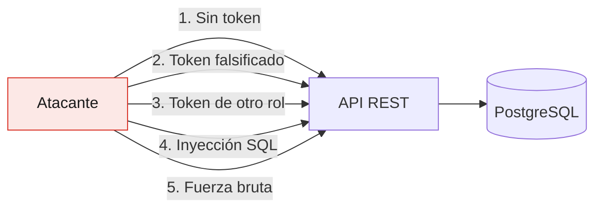

# Informe de Pruebas de Seguridad — CineClub Salamanca

**Universidad Tecnológica del Perú — Curso Integrador I: Sistemas Software**

---

## 1. Conceptos de pruebas de seguridad

Las pruebas de seguridad buscan verificar que el sistema protege la **confidencialidad**,
la **integridad** y la **disponibilidad** de los datos frente a un uso malintencionado. Se
diferencian de las pruebas funcionales en la intención: la prueba funcional comprueba que
el sistema *hace lo que debe*; la de seguridad comprueba que **no hace lo que no debe**.

### Enfoques utilizados

| Enfoque | Qué es | Aplicación en el proyecto |
|---|---|---|
| **SAST** (análisis estático) | Examina el código sin ejecutarlo | Revisión manual de la configuración de seguridad + avisos del compilador |
| **SCA** (análisis de dependencias) | Busca CVE conocidos en librerías de terceros | OWASP Dependency-Check (perfil `seguridad`) |
| **DAST** (análisis dinámico) | Ataca la aplicación en ejecución | `SeguridadIntegrationTest`: peticiones reales contra la cadena de filtros |

### Herramientas

| Herramienta | Uso |
|---|---|
| OWASP Dependency-Check 10.0.4 | Detecta dependencias con vulnerabilidades publicadas (NVD) |
| Spring Security Test | Pruebas de autenticación y autorización |
| MockMvc | Envío de peticiones maliciosas simuladas |
| BCrypt | Verificación del cifrado de contraseñas |

---

## 2. Superficie de ataque analizada



Se evaluaron los riesgos del **OWASP Top 10** aplicables a una API REST de este alcance.

---

## 3. Pruebas ejecutadas

Las 16 pruebas de `SeguridadIntegrationTest` corren en cada `mvnw test`. No son una
auditoría puntual: son una **regresión permanente** — si alguien reabre uno de estos huecos,
la build falla.

### 3.1 Control de acceso (A01: Broken Access Control)

| # | Prueba | Esperado | Resultado |
|---|---|---|---|
| 1 | Endpoint protegido sin token | 401 | ✅ |
| 2 | Token con firma inválida | 401 | ✅ |
| 3 | Usuario autenticado accede a sus reservas | 200 | ✅ |
| 4 | Usuario sin rol admin lista reservas de una función | 403 | ✅ |
| 5 | Administrador lista reservas de una función | 200 | ✅ |
| 6 | Usuario sin rol admin crea películas | 403 | ✅ |
| 7 | Cartelera pública sin autenticación | 200 | ✅ |
| 8 | Métricas de Actuator sin token | 401 | ✅ |
| 9 | Sonda de salud pública | 200 | ✅ |
| 10 | Sonda de salud no expone componentes al anónimo | sin `components` | ✅ |

La prueba 2 usa un token estructuralmente válido pero firmado con otra clave. Verifica que
la validación comprueba **la firma** y no solo el formato — un JWT mal implementado que solo
decodifique el *payload* aceptaría cualquier identidad que el atacante escriba.

### 3.2 Fallos criptográficos (A02: Cryptographic Failures)

| # | Prueba | Esperado | Resultado |
|---|---|---|---|
| 11 | La contraseña se almacena cifrada con BCrypt | hash `$2...`, nunca texto plano | ✅ |
| 12 | La respuesta de login no expone el hash | sin `passwordHash` ni `$2a$` | ✅ |

BCrypt es un algoritmo de hash **adaptativo y con sal**: incorpora un factor de coste que lo
hace deliberadamente lento, lo que encarece los ataques de diccionario. La sal, incluida en
el propio hash, impide precomputar tablas arcoíris. No es reversible: `passwordEncoder.matches()`
vuelve a hashear el intento y compara, sin descifrar nada.

### 3.3 Inyección (A03: Injection)

| # | Prueba | Esperado | Resultado |
|---|---|---|---|
| 13 | Carga `' OR '1'='1'; DROP TABLE usuario; --` en el login | 4xx, base intacta | ✅ |

La prueba comprueba el número de usuarios antes y después: la tabla sigue existiendo y con
el mismo contenido. La protección no viene de filtrar caracteres, sino de que **JPA
parametriza las consultas**: el texto viaja como valor de un parámetro, nunca como parte de
la sentencia SQL. El intento se trata como un email literal que no existe.

La única consulta con JPQL manual del proyecto también usa parámetros con nombre:

```java
@Query("SELECT r.numeroButaca FROM Reserva r WHERE r.funcion.id = :funcionId")
List<String> findButacasOcupadasByFuncionId(Long funcionId);
```

### 3.4 Validación de entrada

| # | Prueba | Esperado | Resultado |
|---|---|---|---|
| 14 | Registro con contraseña de 3 caracteres | 400, usuario no creado | ✅ |
| 15 | Registro con email de formato inválido | 400 | ✅ |
| 16 | Login con contraseña incorrecta | 401 | ✅ |

---

## 4. Observaciones levantadas

### OBS-01 — La API no distinguía 401 de 403 · Severidad: Media · **Corregida**

**Hallazgo.** Las pruebas 1, 2, 8 y 16 fallaron en su primera ejecución: la API devolvía
**403 Forbidden** donde correspondía **401 Unauthorized**.

```
SeguridadIntegrationTest.endpointProtegido_debeRechazarSinToken:82
    Status expected:<401> but was:<403>
SeguridadIntegrationTest.login_debeRechazarPasswordIncorrecta:169
    Status expected:<401> but was:<403>
```

**Causa raíz.** Dos defectos independientes con el mismo síntoma:

1. `SecurityConfig` no declaraba un `AuthenticationEntryPoint`. A falta de uno, y al no
   usarse `formLogin` ni `httpBasic`, Spring Security aplica `Http403ForbiddenEntryPoint`
   por defecto y responde 403 a todo rechazo, incluido el del usuario anónimo.
2. `GlobalExceptionHandler` no manejaba `AuthenticationException`, por lo que un login con
   credenciales incorrectas terminaba en esa misma ruta.

**Impacto.** El cliente no podía distinguir "tu sesión caducó, vuelve a entrar" de "tu
sesión es válida pero no te alcanza el rol". El frontend no tenía forma fiable de decidir
si redirigir al login, y un token expirado se presentaba al usuario como un problema de
permisos. Es además una desviación de la semántica HTTP (RFC 9110 §15.5.2).

**Corrección.**

- `EntradaNoAutenticada` (`AuthenticationEntryPoint`) → 401 con cuerpo JSON.
- `SinPermisos` (`AccessDeniedHandler`) → 403 con el mismo formato.
- `GlobalExceptionHandler` maneja `AuthenticationException` → 401.
- Ambos manejadores se registran en `SecurityConfig` vía `exceptionHandling`.

**Verificación.** Las 16 pruebas pasan. Los mensajes se mantuvieron genéricos
("Credenciales ausentes o inválidas") para no revelar si un correo está registrado.

---

### OBS-02 — Una cartelera vacía tumbaba la sonda de salud · Severidad: Media · **Corregida**

**Hallazgo.** La prueba 9 falló: `GET /actuator/health` devolvía **503 Service Unavailable**.

```
SeguridadIntegrationTest.health_debeSerPublico:149
    Status expected:<200> but was:<503>
```

**Causa raíz.** `CarteleraHealthIndicator` reportaba `DOWN` cuando no había funciones
futuras programadas. Actuator traduce `DOWN` a HTTP 503.

**Impacto.** Un problema de disponibilidad autoinfligido: si el administrador no programaba
funciones, el balanceador habría retirado la instancia de rotación y Docker habría
reiniciado el contenedor en ciclo — todo ello con la aplicación perfectamente sana. Una
condición de negocio se estaba tratando como una avería de infraestructura.

**Corrección.** El indicador usa ahora un estado propio `SIN_CARTELERA` en lugar de `DOWN`.
Actuator mapea a 503 únicamente `DOWN` y `OUT_OF_SERVICE`; los estados no reconocidos se
sirven con 200 y tienen menor precedencia al agregar, de modo que el aviso queda visible en
el detalle sin degradar la salud global. Un fallo real al consultar la base sí sigue
reportando `DOWN`, que es lo correcto.

**Verificación.** `/actuator/health` responde 200 con `status: UP` y la cartelera vacía
aparece como `SIN_CARTELERA` en el detalle, visible solo para administradores.

---

### OBS-03 — Secreto JWT por defecto débil · Severidad: Alta · **Mitigada, requiere acción en despliegue**

**Hallazgo.** `application.properties` define el valor por defecto
`app.jwt.secret=${JWT_SECRET:change_me_in_production}`, y el `.env` de desarrollo trae
`change_me_in_production_cineclub_salamanca_secret_key`.

**Impacto.** Quien conozca el secreto puede **firmar tokens válidos para cualquier usuario,
incluido un administrador**. Al estar el valor en un repositorio, un despliegue que arranque
sin definir `JWT_SECRET` quedaría comprometido desde el primer minuto.

**Estado.** El riesgo es aceptable en desarrollo, donde el dato no tiene valor. **No lo es
en producción.**

**Mitigación aplicada.**

- El perfil `prod` toma `JWT_SECRET` de una variable de entorno, sin valor por defecto.
- `.env` está en `.gitignore` y nunca se ha versionado (verificado con `git ls-files`).
- `.env.example` documenta cómo generar uno adecuado.

**Acción pendiente para el despliegue real:**

```bash
openssl rand -base64 48   # y colocarlo en la variable JWT_SECRET del servidor
```

---

### OBS-04 — Sin límite de intentos de autenticación · Severidad: Media · **Aceptada**

**Hallazgo.** `POST /api/auth/login` no limita los intentos fallidos, lo que permite fuerza
bruta sobre las contraseñas.

**Análisis.** El coste de BCrypt (factor 10 por defecto) ralentiza mucho cada intento, lo
que mitiga parcialmente el ataque, pero no lo impide.

**Decisión: riesgo aceptado en el alcance actual.** Implementar limitación por IP requiere
un almacén compartido (Redis) o `bucket4j`, lo que excede el alcance comprometido del
proyecto. Se documenta como trabajo futuro. La mitigación de despliegue recomendada es
aplicar *rate limiting* en el proxy inverso, fuera de la aplicación.

---

### OBS-05 — Consola H2 accesible con `frameOptions` desactivado · Severidad: Baja · **Mitigada por configuración**

**Hallazgo.** `SecurityConfig` permite `/h2-console/**` sin autenticación y desactiva
`frameOptions`, lo que además abre la puerta a *clickjacking*.

**Análisis.** Ambas cosas existen para que la consola H2 funcione durante el desarrollo.

**Mitigación.** El perfil `prod` fija `spring.h2.console.enabled=false`, de modo que la
ruta no se registra en producción aunque la regla siga en la cadena de filtros. La
dependencia de H2 está declarada con `<scope>runtime</scope>` y solo se usa en los perfiles
`dev` y `test`.

**Recomendación de mejora.** Trasladar la regla de `/h2-console/**` a un
`SecurityFilterChain` anotado con `@Profile("dev")`, para que la excepción no exista
siquiera en el artefacto de producción.

---

## 5. Análisis de dependencias (SCA)

OWASP Dependency-Check contrasta cada dependencia contra la base NVD:

```bash
cd backend
export NVD_API_KEY=tu_api_key      # https://nvd.nist.gov/developers/request-an-api-key
./mvnw verify -Pseguridad
```

Configuración: **la build falla ante cualquier vulnerabilidad de severidad alta o crítica**
(`failBuildOnCVSS=7`). El reporte queda en `backend/target/dependency-check-report.html`.

Se ejecuta bajo el perfil `seguridad` y no en cada build porque la descarga inicial del
catálogo NVD tarda varios minutos; obligarla en cada `mvnw test` haría el ciclo de
desarrollo inviable. La recomendación es ejecutarlo antes de cada entrega y de forma
programada (ver [plan de mantenimiento](PLAN_MANTENIMIENTO.md)).

> **Nota de reproducibilidad:** desde 2023 la API del NVD exige una clave gratuita para
> obtener un rendimiento razonable. Sin `NVD_API_KEY`, el análisis funciona pero se degrada
> a peticiones con límite estricto y puede tardar más de 30 minutos.

---

## 6. Controles de seguridad implementados

| Control | Implementación |
|---|---|
| Autenticación | JWT firmado con HS256 (JJWT 0.12.6) |
| Contraseñas | BCrypt con sal, factor de coste 10 |
| Autorización por ruta | `SecurityConfig.authorizeHttpRequests` |
| Autorización por método | `@PreAuthorize` + `@EnableMethodSecurity` |
| Sesiones | `STATELESS` — sin estado en servidor |
| Validación de entrada | Jakarta Validation (`@Valid`, `@Email`, `@Size`) |
| Inyección SQL | Consultas parametrizadas por JPA |
| Gestión de secretos | Variables de entorno; `.env` fuera de git |
| Fuga de información | `include-stacktrace=never` en `prod`; mensajes genéricos |
| Telemetría protegida | `/actuator/**` restringido a `ROLE_ADMIN` |
| Superficie reducida | Solo se exponen los endpoints de Actuator necesarios |
| Contenedor | Usuario sin privilegios; imagen final sin JDK ni código fuente |

---

## 7. Resumen

| Observación | Severidad | Estado |
|---|---|---|
| OBS-01 — 401 vs 403 indistinguibles | Media | ✅ Corregida |
| OBS-02 — Cartelera vacía → 503 | Media | ✅ Corregida |
| OBS-03 — Secreto JWT por defecto | Alta | ⚠️ Mitigada; requiere acción en despliegue |
| OBS-04 — Sin límite de intentos | Media | 📋 Aceptada; trabajo futuro |
| OBS-05 — Consola H2 en dev | Baja | ✅ Mitigada por perfil |

**Conclusión.** Las dos observaciones corregidas (OBS-01 y OBS-02) las detectaron las
pruebas de integración automatizadas, no una revisión manual — y ninguna prueba unitaria
podría haberlas encontrado, porque ambas viven fuera de los servicios: una en la cadena de
filtros y otra en la agregación de sondas de Actuator. Es el argumento práctico a favor de
tener pruebas en varios niveles.

OBS-03 es la única de severidad alta y **debe resolverse antes de cualquier despliegue
público**: generar un secreto único y entregarlo por variable de entorno.

---

## 8. Documentos relacionados

- [Informe de pruebas de software](INFORME_PRUEBAS.md)
- [Arquitectura](ARQUITECTURA.md)
- [Plan de despliegue](PLAN_DESPLIEGUE.md)
- [Referencias bibliográficas](REFERENCIAS.md)
