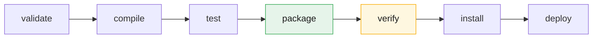
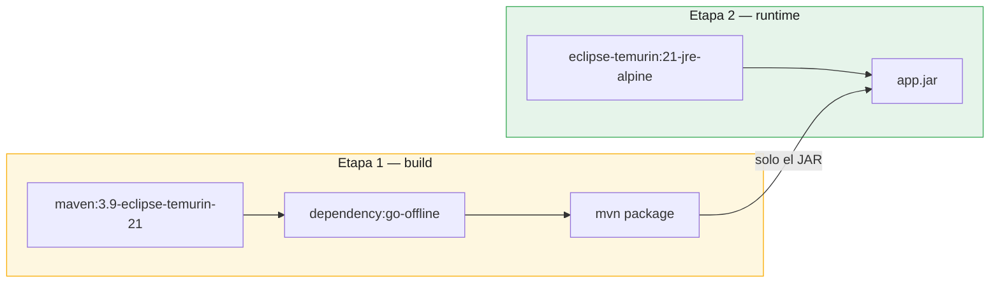

# Plan de despliegue

Proyecto CineClub Salamanca — UTP, Curso Integrador I: Sistemas Software.

## 1. Despliegue de aplicaciones Java con Maven

### Ciclo de vida

Maven organiza la construcción en fases que corren en orden. Al invocar una fase se ejecutan
también todas las anteriores.



| Fase | Qué pasa en este proyecto |
|---|---|
| `compile` | Compila con Java 21 |
| `test` | Corre las 80 pruebas (surefire) |
| `package` | Genera `backend-1.0.0.jar` y el JAR de Javadoc |
| `verify` | Genera el reporte JaCoCo y falla si la cobertura baja del 70% |
| `install` | Copia el artefacto al repositorio local `~/.m2` |

El artefacto es un JAR ejecutable: `spring-boot-maven-plugin` empaqueta la aplicación con
sus dependencias y un Tomcat embebido. No hace falta instalar un servidor de aplicaciones ni
armar un WAR, alcanza con `java -jar app.jar`.

### Maven Wrapper

El proyecto trae `mvnw` y `mvnw.cmd`. El wrapper descarga la versión de Maven declarada en
`.mvn/wrapper/maven-wrapper.properties`, así la build no depende de la versión que tenga
instalada cada integrante. Es la forma recomendada de invocar Maven acá, y es la que usa el
Dockerfile para compilar.

### Perfiles de Spring

La misma imagen sirve para todos los entornos; lo que cambia es el perfil activo.

| Perfil | Base de datos | `ddl-auto` | Datos de ejemplo | Uso |
|---|---|---|---|---|
| `dev` | PostgreSQL (Docker) | `create` | Sí (`DataInitializer`) | Desarrollo local |
| `test` | H2 en memoria | `create-drop` | No | Pruebas |
| `prod` | PostgreSQL (servidor) | `validate` | No | Producción |

En producción usamos `ddl-auto=validate` a propósito: Hibernate comprueba que las tablas
coincidan con las entidades pero no las toca. Con `update`, un cambio accidental en una
entidad modificaría el esquema real sin que nadie lo revise; con `create` lo destruiría.

## 2. Artefactos

| Artefacto | De dónde sale | Qué trae |
|---|---|---|
| `backend-1.0.0.jar` | `mvnw package` | Aplicación + dependencias + Tomcat |
| `backend-1.0.0-javadoc.jar` | `maven-javadoc-plugin` | Documentación del código |
| `cineclub-salamanca/backend:1.0.0` | `docker compose build` | Imagen con JRE 21 + JAR |

### Imagen Docker

El `Dockerfile` es multietapa:



La imagen final no lleva Maven, ni el JDK, ni el código fuente: solo un JRE y el JAR. Pesa
menos y expone menos superficie de ataque.

El `pom.xml` se copia antes que `src/` porque Docker cachea por capas: mientras el pom no
cambie, reutiliza la capa de dependencias y no las vuelve a descargar en cada build.

## 3. Requisitos del servidor

| Componente | Mínimo | Notas |
|---|---|---|
| Docker Engine | 24.x | Con Compose v2 |
| RAM | 2 GB | 1 GB backend + 512 MB PostgreSQL |
| Disco | 10 GB | Imágenes, datos, logs y respaldos |
| Puertos | 3000, 8080, 5432 | El 5432 solo en la red interna |

Sin Docker haría falta Java 21 (JRE) y PostgreSQL 15 instalados directamente.

## 4. Procedimiento

### 4.1 Preparación

```bash
git clone <repositorio> cineclub-salamanca
cd cineclub-salamanca
cp .env.example .env
```

Editar `.env` y definir como mínimo:

```bash
POSTGRES_PASSWORD=<contraseña robusta y única>
JWT_SECRET=<generar con: openssl rand -base64 48>
LOG_LEVEL=INFO
```

Esto es obligatorio. Desplegar con el `JWT_SECRET` de ejemplo permite que cualquiera firme
tokens de administrador (ver OBS-03 en el [informe de seguridad](INFORME_SEGURIDAD.md)).

### 4.2 Verificación previa

No se despliega nada que no pase la suite:

```bash
cd backend
./mvnw clean verify        # 80 pruebas + umbral de cobertura
./mvnw verify -Pseguridad  # dependencias (requiere NVD_API_KEY)
cd ..
```

### 4.3 Despliegue

```bash
docker compose --profile completo up -d --build
```

Construye la imagen del backend, levanta PostgreSQL, espera a que acepte conexiones
(`condition: service_healthy`) y arranca backend y frontend.

### 4.4 Verificación posterior

```bash
docker compose ps                    # los tres servicios healthy
./scripts/healthcheck.sh             # debe responder "OK: la aplicación responde UP"
curl -fsS http://localhost:8080/actuator/health
```

Prueba funcional mínima:

1. Abrir `http://localhost:3000` y ver que carga la cartelera.
2. Registrar un usuario y reservar una butaca.
3. Entrar como administrador y confirmar el ingreso con el código emitido.

Resultado de la última ejecución de este procedimiento: los tres contenedores levantaron,
el backend arrancó con el perfil `prod` en 11,3 segundos, `ddl-auto=validate` pasó contra el
esquema existente, y una reserva de prueba con minibar se creó correctamente (`SLM-77DC0E7F`,
aforo 32 a 31). El detalle está en el [informe de pruebas](INFORME_PRUEBAS.md).

Este despliegue destapó un defecto que la suite no veía: `open-in-view=false` en el perfil
`prod` rompía la cartelera con `LazyInitializationException`. Está documentado en la sección
6 del informe de pruebas. Sirve de aviso: **la configuración de producción hay que probarla
ejecutándola**, porque no la cubre ninguna prueba unitaria.

### 4.5 Esquema en el primer despliegue

Como `prod` usa `ddl-auto=validate`, no crea las tablas: espera encontrarlas. Si la base ya
tiene el esquema (por ejemplo tras una corrida previa en `dev`, que es como se verificó),
arranca sin problema. En un servidor nuevo y con la base vacía hay que crearlas antes. Dos
opciones:

```bash
# A — restaurar un respaldo de desarrollo (recomendada)
./scripts/restore.sh backups/cineclub_<fecha>.sql.gz

# B — arrancar una vez con el perfil dev para generar el esquema y luego pasar a prod
```

Lo correcto sería incorporar Flyway o Liquibase para versionar las migraciones junto con el
código. Queda como trabajo futuro.

## 5. Actualización

```bash
git pull
cd backend && ./mvnw clean verify && cd ..   # nada se despliega sin pasar las pruebas
./scripts/backup.sh                          # respaldo previo
docker compose --profile completo up -d --build backend
./scripts/healthcheck.sh
```

Con `restart: always` y `server.shutdown=graceful`, el contenedor termina las peticiones en
curso antes de detenerse.

## 6. Reversión

Si una versión falla en producción:

```bash
# 1. Volver al commit anterior
git checkout <tag-o-commit-anterior>

# 2. Reconstruir y levantar
docker compose --profile completo up -d --build backend

# 3. Si se afectaron los datos, restaurar el respaldo previo
./scripts/restore.sh --ultimo
```

El respaldo del paso 5 es lo que hace posible este procedimiento. Sin él, volver atrás en el
código no recupera los datos.

## 7. Variables de entorno

Ninguna credencial está en el código ni en los `.properties` versionados.

| Variable | Perfil | Descripción |
|---|---|---|
| `POSTGRES_HOST` | prod | Host de la base (`db` en Compose) |
| `POSTGRES_DB` / `POSTGRES_USER` / `POSTGRES_PASSWORD` | todos | Credenciales |
| `DB_POOL_MAX` | prod | Máximo del pool HikariCP |
| `JWT_SECRET` | todos | Clave de firma (256 bits o más) |
| `JWT_EXPIRATION_MS` | todos | Vigencia del token |
| `SERVER_PORT` / `FRONTEND_PORT` | todos | Puertos publicados |
| `LOG_LEVEL` / `LOG_PATH` | todos | Nivel y ubicación de los logs |
| `RETENCION_MESES` / `RETENCION_DIAS` | todos | Políticas de retención |

## 8. Limitaciones

1. **Sin HTTPS.** El tráfico va en claro, tokens JWT incluidos. Un despliegue público
   necesita un proxy inverso (nginx o Caddy) con certificado de Let's Encrypt.
2. **nginx no hace de proxy inverso**, solo sirve estáticos. El navegador llama al backend
   directo al puerto 8080, que tiene que estar publicado. Configurarlo como proxy
   (`/api` hacia `backend:8080`) dejaría un solo puerto expuesto y de paso resolvería CORS.
3. **Sin migraciones versionadas** (ver 4.5).
4. **El despliegue interrumpe el servicio.** `up -d --build backend` reinicia el contenedor y
   hay unos segundos sin atención. Un despliegue blue-green lo evitaría.
5. **Sin CI/CD.** La verificación es manual. Un workflow de GitHub Actions que corriera
   `mvnw verify` en cada push obligaría a cumplir el paso 4.2.

## Documentos relacionados

- [Arquitectura](ARQUITECTURA.md)
- [Plan de monitoreo](PLAN_MONITOREO.md)
- [Plan de mantenimiento](PLAN_MANTENIMIENTO.md)
- [Informe de seguridad](INFORME_SEGURIDAD.md)
