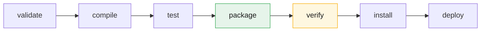
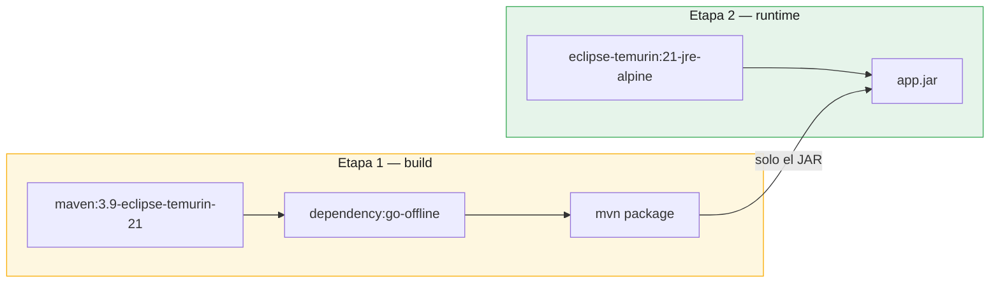

# Plan de Despliegue — CineClub Salamanca

**Universidad Tecnológica del Perú — Curso Integrador I: Sistemas Software**

---

## 1. Conceptos del despliegue de aplicaciones Java con Maven

### El ciclo de vida de Maven

Maven organiza la construcción en **fases** que se ejecutan en orden. Invocar una fase
ejecuta todas las anteriores:



| Fase | Qué ocurre en este proyecto |
|---|---|
| `compile` | Compila las clases con Java 21 |
| `test` | Ejecuta las 69 pruebas (surefire) |
| `package` | Genera `backend-1.0.0.jar` (JAR ejecutable) y el JAR de Javadoc |
| `verify` | Genera el reporte JaCoCo y **falla si la cobertura baja del 70%** |
| `install` | Copia el artefacto al repositorio local `~/.m2` |

El artefacto de despliegue es un **JAR ejecutable** (*fat JAR*): `spring-boot-maven-plugin`
empaqueta la aplicación junto con sus dependencias y un Tomcat embebido. No hace falta
instalar un servidor de aplicaciones ni desplegar un WAR — basta `java -jar app.jar`.

### El Maven Wrapper

El proyecto incluye `mvnw` / `mvnw.cmd`. El wrapper descarga la versión exacta de Maven
declarada en `.mvn/wrapper/maven-wrapper.properties`, de modo que la build no depende de la
versión que cada integrante tenga instalada. **Es la forma recomendada de invocar Maven
aquí**, y la que usa el Dockerfile en su etapa de construcción.

### Perfiles de Spring

La misma imagen sirve para todos los entornos; lo que cambia es el perfil activo.

| Perfil | Base de datos | `ddl-auto` | Datos de ejemplo | Uso |
|---|---|---|---|---|
| `dev` | PostgreSQL (Docker) | `create` | Sí (`DataInitializer`) | Desarrollo local |
| `test` | H2 en memoria | `create-drop` | No | Pruebas automatizadas |
| `prod` | PostgreSQL (servidor) | `validate` | No | Producción |

`ddl-auto=validate` en producción es una decisión deliberada: Hibernate **comprueba** que
las tablas concuerden con las entidades, pero no las modifica. Con `update`, un cambio
accidental en una entidad alteraría el esquema real sin revisión; con `create`, lo
destruiría.

---

## 2. Artefactos

| Artefacto | Origen | Contenido |
|---|---|---|
| `backend-1.0.0.jar` | `mvnw package` | Aplicación + dependencias + Tomcat embebido |
| `backend-1.0.0-javadoc.jar` | `maven-javadoc-plugin` | Documentación técnica del código |
| `cineclub-salamanca/backend:1.0.0` | `docker compose build` | Imagen con JRE 21 + JAR |

### Construcción de la imagen

El `Dockerfile` usa **construcción multietapa**:



Dos decisiones que importan:

- **La imagen final no contiene ni Maven, ni el JDK, ni el código fuente.** Solo un JRE y el
  JAR. Menos peso y menos superficie de ataque.
- **`pom.xml` se copia antes que `src/`.** Docker cachea capas: mientras el `pom.xml` no
  cambie, reutiliza la capa de dependencias y no vuelve a descargarlas en cada build.

---

## 3. Requisitos del servidor

| Componente | Versión mínima | Notas |
|---|---|---|
| Docker Engine | 24.x | Con Docker Compose v2 |
| RAM | 2 GB | 1 GB backend + 512 MB PostgreSQL |
| Disco | 10 GB | Imágenes, volumen de datos, logs y respaldos |
| Puertos | 3000, 8080, 5432 | 5432 solo en la red interna |

Si no se usa Docker: Java 21 (JRE) y PostgreSQL 15 instalados directamente.

---

## 4. Procedimiento de despliegue

### 4.1 Preparación

```bash
git clone <repositorio> cineclub-salamanca
cd cineclub-salamanca
cp .env.example .env
```

Editar `.env` y definir, como mínimo:

```bash
POSTGRES_PASSWORD=<contraseña robusta y única>
JWT_SECRET=<generar con: openssl rand -base64 48>
LOG_LEVEL=INFO
```

> **Obligatorio.** Desplegar con los valores de ejemplo de `JWT_SECRET` permite a cualquiera
> firmar tokens de administrador. Ver OBS-03 en el [informe de seguridad](INFORME_SEGURIDAD.md).

### 4.2 Verificación previa

Nada se despliega sin pasar la suite:

```bash
cd backend
./mvnw clean verify        # 69 pruebas + umbral de cobertura
./mvnw verify -Pseguridad  # análisis de dependencias (requiere NVD_API_KEY)
cd ..
```

### 4.3 Despliegue

```bash
docker compose --profile completo up -d --build
```

Esto construye la imagen del backend, levanta PostgreSQL, espera a que acepte conexiones
(`condition: service_healthy`) y arranca backend y frontend.

### 4.4 Verificación posterior

```bash
docker compose ps                    # los tres servicios en estado healthy
./scripts/healthcheck.sh             # debe responder "OK: la aplicación responde UP"
curl -fsS http://localhost:8080/actuator/health
```

Comprobación funcional mínima:

1. Abrir `http://localhost:3000` — debe cargar la cartelera.
2. Registrar un usuario y reservar una butaca.
3. Entrar como administrador y confirmar el ingreso con el código emitido.

### 4.5 Esquema de base de datos en el primer despliegue

Con `ddl-auto=validate`, el perfil `prod` **no crea las tablas**: espera encontrarlas. En un
servidor nuevo hay que crearlas primero. Dos opciones:

```bash
# Opción A — restaurar un respaldo del entorno de desarrollo (recomendada)
./scripts/restore.sh backups/cineclub_<fecha>.sql.gz

# Opción B — generar el esquema arrancando una vez con el perfil dev, y luego cambiar a prod
```

> **Mejora recomendada.** Incorporar **Flyway** o **Liquibase** para versionar las
> migraciones de esquema junto con el código. Es la solución correcta a este problema y
> queda documentada como trabajo futuro.

---

## 5. Actualización de versión

```bash
git pull
cd backend && ./mvnw clean verify && cd ..   # no se despliega nada que no pase las pruebas
./scripts/backup.sh                          # respaldo previo, imprescindible
docker compose --profile completo up -d --build backend
./scripts/healthcheck.sh
```

`restart: always` y el apagado ordenado (`server.shutdown=graceful`) permiten que el
contenedor termine las peticiones en curso antes de detenerse.

---

## 6. Reversión (rollback)

Si una versión falla en producción:

```bash
# 1. Volver al commit anterior
git checkout <tag-o-commit-anterior>

# 2. Reconstruir y levantar
docker compose --profile completo up -d --build backend

# 3. Si el problema afectó a los datos, restaurar el respaldo previo
./scripts/restore.sh --ultimo
```

El respaldo del paso 5 es lo que hace viable este procedimiento. Sin él, la reversión de
código no recupera los datos.

---

## 7. Configuración por variables de entorno

Ninguna credencial vive en el código ni en los `.properties` versionados.

| Variable | Perfil | Descripción |
|---|---|---|
| `POSTGRES_HOST` | prod | Host de la base (`db` en Compose) |
| `POSTGRES_DB` / `POSTGRES_USER` / `POSTGRES_PASSWORD` | todos | Credenciales |
| `DB_POOL_MAX` | prod | Tamaño máximo del pool HikariCP |
| `JWT_SECRET` | todos | Clave de firma (≥ 256 bits) |
| `JWT_EXPIRATION_MS` | todos | Vigencia del token |
| `SERVER_PORT` / `FRONTEND_PORT` | todos | Puertos publicados |
| `LOG_LEVEL` / `LOG_PATH` | todos | Nivel y ubicación de los logs |
| `RETENCION_MESES` / `RETENCION_DIAS` | todos | Políticas de retención |

---

## 8. Limitaciones conocidas del despliegue

Se declaran explícitamente por honestidad técnica:

1. **Sin HTTPS.** El tráfico viaja en claro, incluidos los tokens JWT. Un despliegue público
   exige un proxy inverso (nginx o Caddy) con certificado TLS de Let's Encrypt.
2. **nginx sirve estáticos, no hace de proxy inverso.** El navegador llama al backend
   directamente en el puerto 8080, que debe estar publicado. Configurar nginx como proxy
   (`/api` → `backend:8080`) permitiría exponer un único puerto y resolvería CORS de paso.
3. **Sin migraciones versionadas.** Ver la nota de la sección 4.5.
4. **Despliegue con interrupción.** `up -d --build backend` reinicia el contenedor: hay unos
   segundos sin servicio. Un despliegue *blue-green* lo evitaría.
5. **Sin CI/CD.** La verificación es manual. Un flujo de GitHub Actions que ejecutase
   `mvnw verify` en cada push haría cumplir automáticamente el paso 4.2.

---

## 9. Documentos relacionados

- [Arquitectura](ARQUITECTURA.md) — vista de despliegue
- [Plan de monitoreo](PLAN_MONITOREO.md) — qué observar tras desplegar
- [Plan de mantenimiento](PLAN_MANTENIMIENTO.md) — respaldos y tareas programadas
- [Informe de seguridad](INFORME_SEGURIDAD.md) — OBS-03, acción obligatoria
