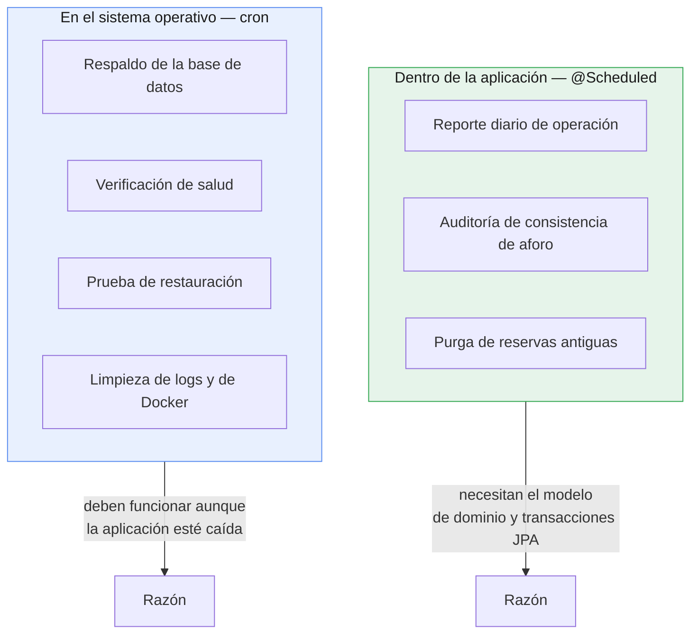

# Plan de mantenimiento

Proyecto CineClub Salamanca — UTP, Curso Integrador I: Sistemas Software.

## 1. Objetivo

El mantenimiento cubre lo que mantiene el sistema operativo y recuperable después del
despliegue: tareas programadas, respaldos y scripts de operación.

### Tipos aplicados

| Tipo | Qué es | Ejemplo en el proyecto |
|---|---|---|
| Correctivo | Reparar defectos encontrados | Corrección de OBS-01 (401/403) |
| Preventivo | Evitar que aparezcan problemas | Auditoría semanal de aforo, respaldos diarios |
| Perfectivo | Mejorar lo que ya existe | Subir la cobertura del 49% al 100% |
| Adaptativo | Ajustarse a cambios del entorno | Análisis de CVE en dependencias |

## 2. Dónde vive cada tarea

Las tareas están repartidas entre la aplicación y el sistema operativo, según lo que
necesitan.



El criterio es simple: si la tarea necesita entender el negocio va en la aplicación, y si
tiene que funcionar cuando la aplicación no funciona va en cron. Un respaldo programado
dentro de la aplicación sería inútil justo cuando más se lo necesita.

## 3. Cron jobs de la aplicación

Están en `TareasMantenimiento` y las habilita `SchedulingConfig`. Las expresiones cron se
pueden ajustar por entorno sin recompilar, y todas las tareas dejan su resultado en el log
con el prefijo `[MANTENIMIENTO]`.

### 3.1 Reporte diario, `0 0 23 * * *`

Registra cuántas reservas se emitieron y cuánto aforo queda. Permite reconstruir la
actividad histórica desde los logs rotados aunque las reservas ya se hayan purgado.

```
[MANTENIMIENTO] Reporte diario 2026-07-16 — reservas emitidas: 12, funciones futuras: 8, aforo libre: 94
```

### 3.2 Auditoría de aforo, `0 30 3 * * MON`

Es la tarea más importante del plan, porque compensa una debilidad conocida del diseño.

`aforo_disponible` es un contador denormalizado que se descuenta al crear cada reserva.
`ReservaService.crear()` consulta la disponibilidad y después escribe, sin bloqueo, así que
entre esas dos operaciones cabe otra transacción. Dos reservas simultáneas pueden dejar el
contador distinto del número real de reservas.

La tarea recalcula el valor correcto (`aforoMaximo − reservas`) para cada función futura,
corrige lo que esté mal y lo anota:

```
[MANTENIMIENTO] Aforo inconsistente en función 3 — registrado: 12, real: 11. Corrigiendo.
[MANTENIMIENTO] Auditoría de aforo completada — funciones revisadas: 8, corregidas: 1
```

Cada línea de `Aforo inconsistente` no es solo una corrección, es una señal: si aparecen
seguido significa que el problema de concurrencia se está dando de verdad y hay que
implementar bloqueo optimista con `@Version` en `Funcion`. Los umbrales están en el
[plan de monitoreo](PLAN_MONITOREO.md).

Corre los lunes a las 03:30, fuera del horario de funciones, para no competir con el
tráfico real.

### 3.3 Purga de reservas, `0 0 4 1 * *`

Evita que la tabla `reserva` crezca sin límite. Borra las reservas de funciones anteriores a
`RETENCION_MESES` (12 por defecto), y los detalles del minibar caen en cascada. No se pierde
información de gestión: queda agregada en los reportes diarios del log.

### 3.4 Resumen

| Tarea | Cron | Frecuencia | Propiedad |
|---|---|---|---|
| Reporte diario | `0 0 23 * * *` | Diaria, 23:00 | `app.mantenimiento.cron.reporte-diario` |
| Auditoría de aforo | `0 30 3 * * MON` | Lunes, 03:30 | `app.mantenimiento.cron.auditoria-aforo` |
| Purga de reservas | `0 0 4 1 * *` | Día 1, 04:00 | `app.mantenimiento.cron.purga-reservas` |

En el perfil `test` las tres se desactivan con el valor `-` para que no se disparen durante
las pruebas.

## 4. Cron jobs del sistema operativo

Instalación en el servidor:

```bash
crontab scripts/crontab.example
crontab -l                          # verificar
mkdir -p /var/log/cineclub          # destino de los logs
```

| Tarea | Programación | Script |
|---|---|---|
| Respaldo de la base | Diario, 02:00 | `backup.sh` |
| Verificación de salud | Cada 5 min | `healthcheck.sh` |
| Prueba de restauración | Día 15, 05:00 | `restore.sh --ultimo` sobre base de ensayo |
| Limpieza de logs > 90 días | Domingos, 04:30 | `find ... -delete` |
| Poda de Docker | Domingos, 05:30 | `docker system prune` |

## 5. Respaldos

### 5.1 Estrategia

| Aspecto | Decisión |
|---|---|
| Herramienta | `pg_dump` dentro del contenedor |
| Formato | SQL comprimido con gzip (`.sql.gz`) |
| Frecuencia | Diaria, 02:00 |
| Retención | 30 días (`RETENCION_DIAS`) |
| Ubicación | `backups/`, ignorado por git |
| Nombre | `cineclub_YYYYMMDD_HHMMSS.sql.gz` |
| Verificación | Prueba de restauración mensual |

`pg_dump` corre con `--clean --if-exists`, así el volcado se puede restaurar sobre una base
existente sin recrearla a mano.

### 5.2 Ejecución

```bash
./scripts/backup.sh                      # Linux/macOS
powershell -File scripts\backup.ps1      # Windows
```

Salida:

```
[2026-07-16 02:00:01] Iniciando respaldo de la base 'cineclub'...
[2026-07-16 02:00:03] Respaldo completado: backups/cineclub_20260716_020001.sql.gz (48K)
[2026-07-16 02:00:03] Retencion (30 dias): 1 respaldo(s) antiguo(s) eliminado(s).
[2026-07-16 02:00:03] Respaldos vigentes: 30
```

### 5.3 Verificación realizada

El ciclo completo se probó contra el stack desplegado, no solo sobre el papel:

| Paso | Resultado |
|---|---|
| `backup.sh` sobre PostgreSQL en Docker | Volcado de 4.0K generado, retención aplicada |
| Contenido del volcado | 12 sentencias SQL (esquema y datos) |
| Restauración sobre base de ensayo | Las 6 tablas y la reserva `SLM-77DC0E7F` se recuperan |
| `restore.sh --ultimo` | Selecciona el respaldo más reciente, pide confirmación y restaura |
| Datos tras restaurar | 1 reserva, 8 películas, 8 funciones, 3 usuarios |
| Aplicación tras restaurar | `healthcheck.sh` responde UP |

La prueba de restauración se hizo sobre una base de ensayo (`cineclub_ensayo`) y no sobre la
real, que es justamente el procedimiento del punto 5.6.

Una limitación del script que conviene conocer: `restore.sh` hace `source .env`, así que la
base destino no se puede cambiar con una variable de entorno. Para restaurar en otro sitio
hay que apuntar a otro contenedor con `CONTENEDOR_DB`, que es lo que hace el crontab.

### 5.4 Comprobación de integridad

El script verifica que el volcado no haya quedado vacío, y si lo está borra el archivo y
sale con error. Sin ese control, una falla de `pg_dump` dejaría un `.sql.gz` de 0 bytes con
pinta de respaldo válido, y con el tiempo la retención iría borrando los buenos hasta dejar
solo archivos inservibles. Es la forma más traicionera en que falla un sistema de respaldos.

### 5.5 Restauración

```bash
./scripts/restore.sh --ultimo                                  # el más reciente
./scripts/restore.sh backups/cineclub_20260716_020001.sql.gz   # uno puntual
```

El script pide escribir `restaurar` para confirmar, porque sobrescribe la base actual y no
hay vuelta atrás.

### 5.6 Prueba mensual de restauración

Un respaldo que nunca se restauró no sirve de garantía, porque nadie sabe si funciona. El
día 15 de cada mes cron restaura el último volcado sobre una base de ensayo
(`cineclub-db-ensayo`) para comprobar que el procedimiento anda, sin tocar producción.

### 5.7 Regla 3-2-1 (pendiente)

La práctica recomendada es tener 3 copias, en 2 medios distintos, y 1 fuera del sitio. Hoy
tenemos las copias locales, pero todas viven en el mismo servidor: si se rompe el disco se
van junto con la base. Sincronizarlas a almacenamiento externo cerraría el hueco:

```bash
# Agregar al crontab, después del respaldo diario
30 2 * * * rclone sync /opt/cineclub-salamanca/backups remoto:cineclub-backups
```

## 6. Scripts

| Script | Plataforma | Función |
|---|---|---|
| `scripts/backup.sh` | Linux/macOS | Respaldo con retención |
| `scripts/backup.ps1` | Windows | Equivalente para desarrollo |
| `scripts/restore.sh` | Linux/macOS | Restauración con confirmación |
| `scripts/healthcheck.sh` | Linux/macOS | Sonda de salud para cron o alertas |
| `scripts/crontab.example` | Linux | Programación de referencia |
| `backend/iniciar.{cmd,ps1,sh}` | Todas | Arranque en desarrollo |
| `backend/test.cmd` | Windows | Ejecución de la suite |

Todos cargan la configuración desde `.env`, validan que estén las variables necesarias y
registran cada paso con fecha. Ninguno recibe credenciales por línea de comandos, donde
quedarían visibles en el historial del shell y en `ps`.

## 7. Calendario

| Frecuencia | Actividad | Automatizada |
|---|---|---|
| Cada 5 min | Verificación de salud | Sí, cron |
| Diaria 02:00 | Respaldo de la base | Sí, cron |
| Diaria 23:00 | Reporte de operación | Sí, `@Scheduled` |
| Diaria | Revisión de errores del log | No |
| Semanal (lun 03:30) | Auditoría de aforo | Sí, `@Scheduled` |
| Semanal (dom) | Limpieza de logs y poda de Docker | Sí, cron |
| Semanal | Revisión de métricas | No |
| Mensual (día 1) | Purga de reservas antiguas | Sí, `@Scheduled` |
| Mensual (día 15) | Prueba de restauración | Sí, cron |
| Mensual | `./mvnw verify -Pseguridad` | No |
| Trimestral | Actualización de dependencias | No |
| Trimestral | Recalibrar umbrales | No |

## 8. Dependencias

```bash
cd backend
./mvnw versions:display-dependency-updates   # qué está desactualizado
./mvnw verify -Pseguridad                    # qué tiene CVE conocidos
```

Criterio para actualizar:

| Situación | Acción |
|---|---|
| CVE alto o crítico | Actualizar de inmediato |
| Versión de parche (3.4.5 a 3.4.6) | Actualizar en la revisión trimestral |
| Versión menor (3.4 a 3.5) | Evaluar cambios y probar |
| Versión mayor (3.x a 4.x) | Planificar, puede traer incompatibilidades |

Después de cualquier actualización va un `./mvnw clean verify`. Las 80 pruebas son la red
que detecta si una dependencia nueva rompió algo.

## 9. Recuperación ante desastres

| Escenario | Procedimiento | Tiempo estimado |
|---|---|---|
| Contenedor caído | `restart: always` lo reinicia solo | < 1 min |
| Datos corruptos | `./scripts/restore.sh --ultimo` | ~5 min |
| Versión defectuosa | Rollback (ver [plan de despliegue](PLAN_DESPLIEGUE.md)) | ~10 min |
| Pérdida del servidor | Reinstalar Docker, clonar repo, restaurar respaldo | ~1 h |

Objetivos declarados:

- **RPO** (pérdida máxima de datos tolerable): 24 h. Sale directo de respaldar una vez por
  día. Bajarlo pediría respaldos más seguidos o replicación.
- **RTO** (tiempo máximo de recuperación): 1 h en el peor caso.

Los dos son razonables para un cineclub con funciones semanales y reserva gratuita. Un
sistema con pagos necesitaría números muy distintos.

## 10. Limitaciones

1. **Respaldos sin copia externa** (ver 5.7): si se rompe el disco se pierden la base y sus
   respaldos.
2. **Sin migraciones versionadas.** Un cambio de entidad puede dejar el esquema restaurado
   incompatible con el código. Flyway lo resolvería.
3. **Revisión de logs manual.** No hay agregación ni alertas por patrón.
4. **La purga no archiva.** Las reservas borradas no se exportan a almacenamiento frío, solo
   queda el agregado del log.
5. **Sin ventana de mantenimiento formal.** Las actualizaciones cortan el servicio unos
   segundos sin avisar a los usuarios.

## Documentos relacionados

- [Plan de despliegue](PLAN_DESPLIEGUE.md)
- [Plan de monitoreo](PLAN_MONITOREO.md)
- [Arquitectura](ARQUITECTURA.md)
- [Informe de pruebas](INFORME_PRUEBAS.md)
