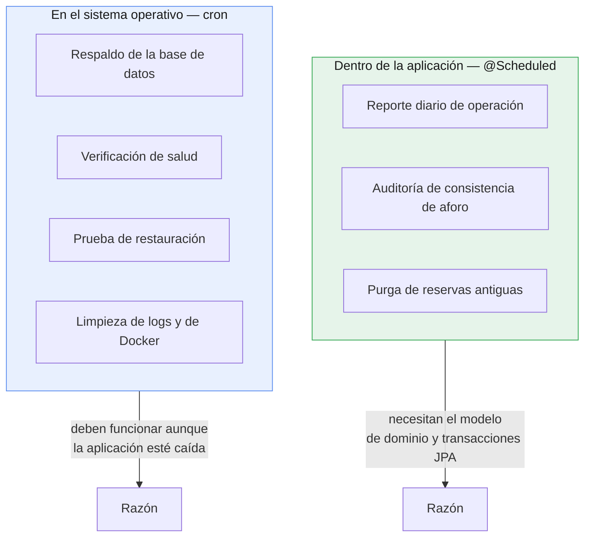

# Plan de Mantenimiento — CineClub Salamanca

**Universidad Tecnológica del Perú — Curso Integrador I: Sistemas Software**

---

## 1. Objetivo y alcance

El mantenimiento cubre todo lo que mantiene el sistema operativo y recuperable **después**
del despliegue: tareas programadas, respaldos y scripts de operación.

### Tipos de mantenimiento aplicados

| Tipo | Qué es | Ejemplo en el proyecto |
|---|---|---|
| **Correctivo** | Reparar defectos detectados | Corrección de OBS-01 (401/403) |
| **Preventivo** | Evitar que aparezcan problemas | Auditoría semanal de aforo; respaldos diarios |
| **Perfectivo** | Mejorar lo existente | Ampliación de la cobertura del 49% al 100% |
| **Adaptativo** | Ajustarse a cambios del entorno | Análisis de CVE en dependencias |

---

## 2. Dónde vive cada tarea, y por qué

Una decisión de arquitectura que conviene explicar: las tareas están repartidas entre la
aplicación y el sistema operativo, según lo que necesitan.



El criterio es simple: **si la tarea necesita entender el negocio, va en la aplicación; si
tiene que funcionar cuando la aplicación no funciona, va en cron.** Un respaldo programado
dentro de la aplicación sería inútil justo cuando más se necesita.

---

## 3. Cron jobs de la aplicación

Implementados en `TareasMantenimiento`, habilitados por `SchedulingConfig`. Todas las
expresiones cron son configurables por entorno sin recompilar, y todas las tareas registran
su resultado en el log con el prefijo `[MANTENIMIENTO]`.

### 3.1 Reporte diario de operación — `0 0 23 * * *`

Deja constancia diaria del volumen de reservas y el aforo remanente. Permite reconstruir la
actividad histórica desde los logs rotados aunque las reservas se hayan purgado.

```
[MANTENIMIENTO] Reporte diario 2026-07-16 — reservas emitidas: 12, funciones futuras: 8, aforo libre: 94
```

### 3.2 Auditoría de consistencia de aforo — `0 30 3 * * MON`

**La tarea más importante del plan**, porque compensa una debilidad conocida del diseño.

`aforo_disponible` es un contador denormalizado que se decrementa al crear cada reserva.
`ReservaService.crear()` comprueba la disponibilidad y después escribe, sin bloqueo: entre
ambas operaciones cabe otra transacción. Dos reservas simultáneas pueden desviar el contador
respecto al número real de reservas.

La tarea recalcula el valor correcto (`aforoMaximo − reservas`) para cada función futura,
corrige las desviaciones y las registra:

```
[MANTENIMIENTO] Aforo inconsistente en función 3 — registrado: 12, real: 11. Corrigiendo.
[MANTENIMIENTO] Auditoría de aforo completada — funciones revisadas: 8, corregidas: 1
```

**Cada línea `Aforo inconsistente` es una señal de diagnóstico**, no solo una corrección: si
aparecen con regularidad, el defecto de concurrencia se está materializando y hay que
implementar bloqueo optimista (`@Version` en `Funcion`). Ver umbrales en el
[plan de monitoreo](PLAN_MONITOREO.md).

Se ejecuta a las 03:30 del lunes, fuera del horario de funciones, para no competir con el
tráfico real.

### 3.3 Purga de reservas antiguas — `0 0 4 1 * *`

Evita el crecimiento indefinido de la tabla `reserva`. Elimina las reservas de funciones
anteriores a `RETENCION_MESES` (12 por defecto); los detalles del minibar se borran en
cascada. La información de gestión no se pierde: queda agregada en los reportes diarios del
log.

### 3.4 Resumen

| Tarea | Cron | Frecuencia | Propiedad configurable |
|---|---|---|---|
| Reporte diario | `0 0 23 * * *` | Diaria, 23:00 | `app.mantenimiento.cron.reporte-diario` |
| Auditoría de aforo | `0 30 3 * * MON` | Lunes, 03:30 | `app.mantenimiento.cron.auditoria-aforo` |
| Purga de reservas | `0 0 4 1 * *` | Día 1, 04:00 | `app.mantenimiento.cron.purga-reservas` |

> En el perfil `test` las tres se desactivan con el valor `-`, para que no se disparen
> durante las pruebas.

---

## 4. Cron jobs del sistema operativo

Instalación en el servidor:

```bash
crontab scripts/crontab.example
crontab -l                          # verificar
mkdir -p /var/log/cineclub          # destino de los logs de las tareas
```

| Tarea | Programación | Script |
|---|---|---|
| Respaldo de la base | Diario, 02:00 | `backup.sh` |
| Verificación de salud | Cada 5 min | `healthcheck.sh` |
| Prueba de restauración | Día 15, 05:00 | `restore.sh --ultimo` (base de ensayo) |
| Limpieza de logs > 90 días | Domingos, 04:30 | `find ... -delete` |
| Poda de Docker | Domingos, 05:30 | `docker system prune` |

---

## 5. Respaldos

### 5.1 Estrategia

| Aspecto | Decisión |
|---|---|
| Herramienta | `pg_dump` dentro del contenedor |
| Formato | SQL comprimido con gzip (`.sql.gz`) |
| Frecuencia | Diaria, 02:00 |
| Retención | 30 días (`RETENCION_DIAS`) |
| Ubicación | `backups/` (ignorado por git) |
| Nomenclatura | `cineclub_YYYYMMDD_HHMMSS.sql.gz` |
| Verificación | Prueba de restauración mensual |

`pg_dump` se ejecuta con `--clean --if-exists`, de modo que el volcado puede restaurarse
sobre una base existente sin recrearla a mano.

### 5.2 Ejecución

```bash
./scripts/backup.sh                      # Linux/macOS
powershell -File scripts\backup.ps1      # Windows
```

Salida:

```
[2026-07-16 02:00:01] Iniciando respaldo de la base 'cineclub'...
[2026-07-16 02:00:03] Respaldo completado: backups/cineclub_20260716_020001.sql.gz (48K)
[2026-07-16 02:00:03] Retencion (30 dias): 1 respaldo(s) antiguo(s) eliminado(s).
[2026-07-16 02:00:03] Respaldos vigentes: 30
```

### 5.3 Comprobación de integridad

El script **verifica que el volcado no quede vacío** y, si lo está, borra el archivo y sale
con error. Sin esa comprobación, un fallo de `pg_dump` dejaría un `.sql.gz` de 0 bytes que
parece un respaldo válido — y la retención acabaría borrando los buenos, dejando solo
archivos inservibles. Es el modo de fallo más traicionero de un sistema de respaldos.

### 5.4 Restauración

```bash
./scripts/restore.sh --ultimo                                  # el más reciente
./scripts/restore.sh backups/cineclub_20260716_020001.sql.gz   # uno concreto
```

El script exige escribir `restaurar` para confirmar: sobrescribe la base actual y no hay
deshacer.

### 5.5 Prueba mensual de restauración

**Un respaldo que nunca se ha restaurado no es un respaldo: es un archivo con buenas
intenciones.** El día 15 de cada mes, cron restaura el último volcado sobre una base de
ensayo (`cineclub-db-ensayo`) para verificar que el procedimiento funciona de verdad, sin
tocar producción.

### 5.6 Regla 3-2-1 (mejora pendiente)

La práctica recomendada es: 3 copias, en 2 medios distintos, 1 de ellas fuera del sitio.
El plan actual cubre las copias locales, pero **todas viven en el mismo servidor**: un fallo
de disco se las lleva junto con la base. Sincronizarlas a almacenamiento externo cerraría la
brecha:

```bash
# Añadir al crontab, tras el respaldo diario
30 2 * * * rclone sync /opt/cineclub-salamanca/backups remoto:cineclub-backups
```

---

## 6. Scripts de operación

| Script | Plataforma | Función |
|---|---|---|
| `scripts/backup.sh` | Linux/macOS | Respaldo con retención |
| `scripts/backup.ps1` | Windows | Equivalente para desarrollo |
| `scripts/restore.sh` | Linux/macOS | Restauración con confirmación |
| `scripts/healthcheck.sh` | Linux/macOS | Sonda de salud para cron o alertas |
| `scripts/crontab.example` | Linux | Programación de referencia |
| `backend/iniciar.{cmd,ps1,sh}` | Todas | Arranque en desarrollo |
| `backend/test.cmd` | Windows | Ejecución de la suite |

Todos cargan la configuración desde `.env`, validan que las variables necesarias existan y
registran cada paso con marca temporal. Ninguno acepta credenciales por línea de comandos,
donde quedarían visibles en el historial del shell y en `ps`.

---

## 7. Calendario

| Frecuencia | Actividad | Automatizada |
|---|---|---|
| **Cada 5 min** | Verificación de salud | ✅ cron |
| **Diaria 02:00** | Respaldo de la base | ✅ cron |
| **Diaria 23:00** | Reporte de operación | ✅ `@Scheduled` |
| **Diaria** | Revisión de errores en el log | ❌ Manual |
| **Semanal (lun 03:30)** | Auditoría de aforo | ✅ `@Scheduled` |
| **Semanal (dom)** | Limpieza de logs y poda de Docker | ✅ cron |
| **Semanal** | Revisión de métricas | ❌ Manual |
| **Mensual (día 1)** | Purga de reservas antiguas | ✅ `@Scheduled` |
| **Mensual (día 15)** | Prueba de restauración | ✅ cron |
| **Mensual** | `./mvnw verify -Pseguridad` (CVE) | ❌ Manual |
| **Trimestral** | Actualización de dependencias | ❌ Manual |
| **Trimestral** | Recalibración de umbrales | ❌ Manual |

---

## 8. Mantenimiento de dependencias

```bash
cd backend
./mvnw versions:display-dependency-updates   # ¿qué hay desactualizado?
./mvnw verify -Pseguridad                    # ¿alguna tiene CVE conocidos?
```

Criterio de actualización:

| Situación | Acción |
|---|---|
| CVE de severidad alta o crítica | Actualizar de inmediato |
| Versión de parche (3.4.5 → 3.4.6) | Actualizar en la revisión trimestral |
| Versión menor (3.4 → 3.5) | Evaluar cambios y probar |
| Versión mayor (3.x → 4.x) | Planificar; puede haber cambios incompatibles |

Tras cualquier actualización: `./mvnw clean verify`. Las 79 pruebas son la red que detecta
una regresión introducida por una dependencia nueva.

---

## 9. Recuperación ante desastres

| Escenario | Procedimiento | Tiempo estimado |
|---|---|---|
| Contenedor caído | `restart: always` lo reinicia solo | < 1 min |
| Datos corruptos | `./scripts/restore.sh --ultimo` | ~5 min |
| Versión defectuosa | Rollback (ver [plan de despliegue](PLAN_DESPLIEGUE.md)) | ~10 min |
| Pérdida del servidor | Reinstalar Docker → clonar repo → restaurar respaldo | ~1 h |

**Objetivos declarados:**

- **RPO** (pérdida máxima de datos tolerable): **24 h** — es la consecuencia directa de
  respaldar una vez al día. Reducirlo exigiría respaldos más frecuentes o replicación.
- **RTO** (tiempo máximo de recuperación): **1 h** en el peor escenario.

Ambos son adecuados para un cineclub con funciones semanales y reserva gratuita. Un sistema
con pagos exigiría cifras muy distintas.

---

## 10. Limitaciones conocidas

1. **Respaldos sin copia externa.** Ver 5.6 — el fallo de un disco se lleva la base y sus
   respaldos.
2. **Sin migraciones versionadas.** Un cambio de entidad puede dejar el esquema restaurado
   incompatible con el código. Flyway lo resolvería.
3. **Revisión de logs manual.** No hay agregación ni alertas por patrón.
4. **La purga no archiva.** Las reservas eliminadas no se exportan a almacenamiento frío;
   solo queda el agregado del log.
5. **Sin ventana de mantenimiento formal.** Las actualizaciones interrumpen el servicio unos
   segundos, sin aviso previo a los usuarios.

---

## 11. Documentos relacionados

- [Plan de despliegue](PLAN_DESPLIEGUE.md)
- [Plan de monitoreo](PLAN_MONITOREO.md)
- [Arquitectura](ARQUITECTURA.md) — sobre `aforo_disponible` denormalizado
- [Informe de pruebas](INFORME_PRUEBAS.md) — limitación de concurrencia
