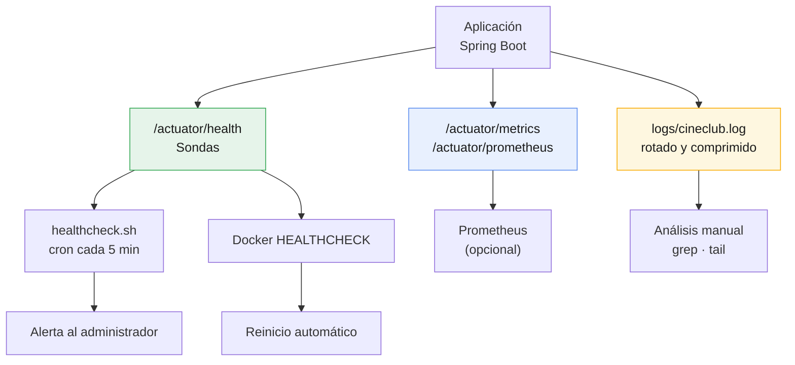
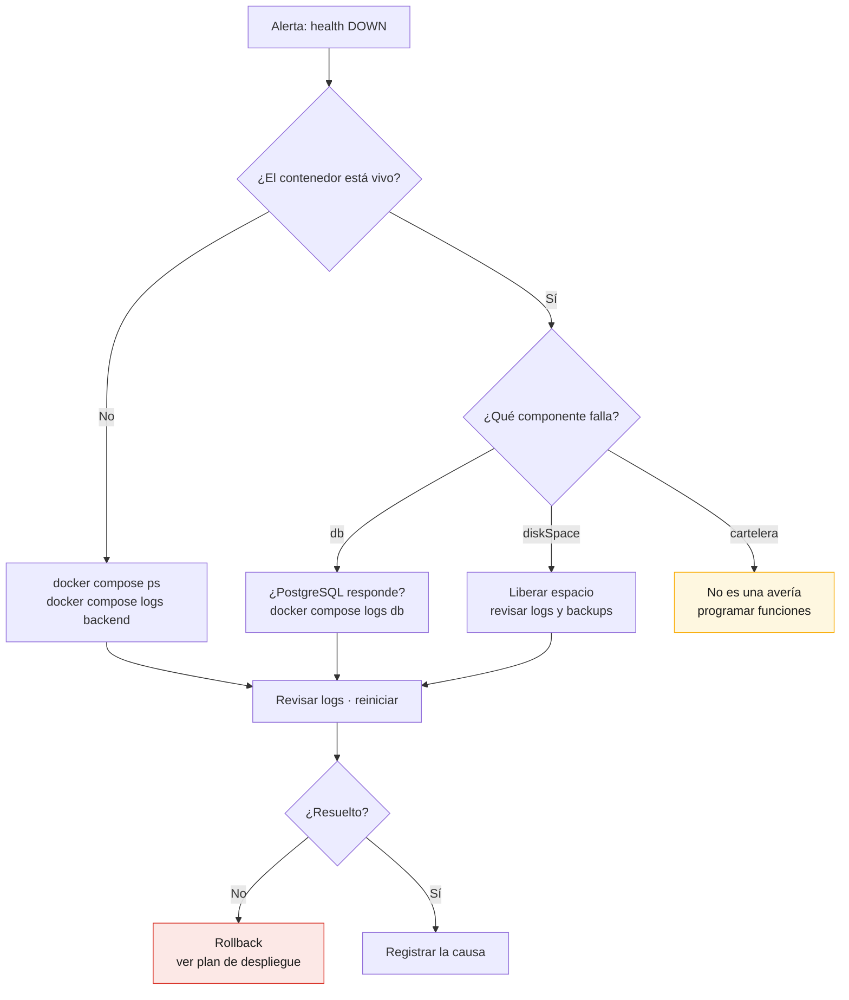

# Plan de Monitoreo — CineClub Salamanca

**Universidad Tecnológica del Perú — Curso Integrador I: Sistemas Software**

---

## 1. Objetivo y alcance

Monitorear no es "guardar logs por si acaso": es poder responder tres preguntas concretas
cuando algo va mal, y idealmente **antes** de que el usuario lo note.

| Pregunta | Herramienta que la responde |
|---|---|
| ¿La aplicación está viva y puede atender? | *Health tools* — Actuator health |
| ¿Está respondiendo con la rapidez esperada? | *Performance tools* — métricas de Micrometer |
| ¿Qué ocurrió exactamente y cuándo? | *Logs* — Logback con rotación |

Los tres pilares se implementan sobre **Spring Boot Actuator**, que expone la telemetría por
HTTP sin código adicional, y **Micrometer**, que actúa como fachada de métricas
(el mismo código sirve para Prometheus, Graphite o New Relic).



---

## 2. Health tools — herramientas de salud

### 2.1 Endpoints

| Endpoint | Acceso | Uso |
|---|---|---|
| `/actuator/health` | Público | Estado global; consumido por el balanceador |
| `/actuator/health/liveness` | Público | ¿El proceso está vivo? Usado por el `HEALTHCHECK` de Docker |
| `/actuator/health/readiness` | Público | ¿Puede aceptar tráfico? |
| `/actuator/info` | Público | Versión y metadatos del *build* |

El acceso público a `health` es deliberado: un balanceador no puede autenticarse. Pero
`show-details=when-authorized` hace que el anónimo vea **solo el estado**, mientras que el
detalle de los componentes internos requiere `ROLE_ADMIN`. Exponer que "la base de datos
está caída" a cualquiera es información útil para un atacante.

### 2.2 Sondas activas

| Sonda | Origen | Qué verifica |
|---|---|---|
| `db` | Automática (Actuator) | Conectividad con PostgreSQL |
| `diskSpace` | Automática | Espacio libre en disco |
| `ping` | Automática | El proceso responde |
| `cartelera` | **Propia** | Hay funciones futuras programadas |

### 2.3 La sonda de cartelera y por qué no reporta DOWN

`CarteleraHealthIndicator` es una sonda **funcional**, no técnica: la aplicación puede estar
perfectamente sana y ser inútil para el espectador si la cartelera está vacía.

La decisión de diseño importante es que una cartelera vacía se reporta con un estado propio
`SIN_CARTELERA` y **no** con `DOWN`. Actuator traduce `DOWN` a HTTP 503, lo que haría que el
balanceador retirase la instancia y Docker reiniciase el contenedor — todo por una condición
de negocio, no por una avería. Los estados no reconocidos se sirven con HTTP 200 y tienen
menor precedencia al agregar, así que el aviso queda visible sin degradar la salud global.

Este comportamiento se descubrió mediante las pruebas de integración (OBS-02 del
[informe de seguridad](INFORME_SEGURIDAD.md)) y está fijado por un test de regresión.

Un fallo real al consultar la base sí reporta `DOWN`, porque ahí sí hay una avería.

### 2.4 Respuesta

```jsonc
// Anónimo — GET /actuator/health
{ "status": "UP" }

// Administrador — GET /actuator/health
{
  "status": "UP",
  "components": {
    "cartelera":  { "status": "UP", "details": { "funcionesFuturas": 8 } },
    "db":         { "status": "UP", "details": { "database": "PostgreSQL" } },
    "diskSpace":  { "status": "UP", "details": { "free": 42000000000 } },
    "ping":       { "status": "UP" }
  }
}
```

### 2.5 Verificación automatizada

Dos consumidores independientes, con propósitos distintos:

| Consumidor | Frecuencia | Acción ante fallo |
|---|---|---|
| `HEALTHCHECK` de Docker | 30 s | Marca el contenedor `unhealthy`; con `restart: always`, lo reinicia |
| `scripts/healthcheck.sh` vía cron | 5 min | Registra en `/var/log/cineclub/health.log` y notifica por `MAILTO` |

El script devuelve código de salida 0 (UP) o 1 (DOWN/inaccesible), apto para encadenarlo con
cualquier sistema de alertas.

---

## 3. Performance tools — métricas

### 3.1 Endpoints

| Endpoint | Acceso | Formato |
|---|---|---|
| `/actuator/metrics` | `ROLE_ADMIN` | Lista de métricas; JSON por métrica |
| `/actuator/prometheus` | `ROLE_ADMIN` | Formato de exposición Prometheus |

### 3.2 Métricas técnicas (automáticas)

| Métrica | Qué indica | Umbral de atención |
|---|---|---|
| `http.server.requests` | Latencia y volumen por endpoint y código | p95 > 1 s |
| `jvm.memory.used` | Memoria del heap | > 80% del máximo |
| `jvm.gc.pause` | Pausas del recolector de basura | > 500 ms |
| `hikaricp.connections.active` | Conexiones en uso | ≈ `DB_POOL_MAX` de forma sostenida |
| `hikaricp.connections.pending` | Peticiones esperando conexión | > 0 sostenido |
| `system.cpu.usage` | CPU del proceso | > 85% sostenido |
| `logback.events` | Eventos por nivel | Crecimiento de `error` |

`http.server.requests` está configurada con **histograma de percentiles** (p50, p95, p99).
El promedio engaña: una media de 200 ms puede esconder que 1 de cada 20 usuarios espera 3
segundos. El p95 es el que refleja la experiencia real.

### 3.3 Métricas de negocio (propias)

`MetricasNegocio` publica indicadores que Actuator no puede conocer:

| Métrica | Qué responde |
|---|---|
| `cineclub.reservas.totales` | ¿Cuántas reservas acumula el sistema? |
| `cineclub.reservas.asistencias` | ¿Cuántos espectadores llegaron realmente a la sala? |
| `cineclub.funciones.futuras` | ¿Hay cartelera publicada? |
| `cineclub.aforo.disponible` | ¿Cuántas butacas quedan libres? |
| `cineclub.usuarios.registrados` | ¿Crece la base de socios? |

Se implementan como `MeterBinder` y no instrumentando los servicios: así la lógica de
negocio no cambia cuando cambia el monitoreo (principio de responsabilidad única).

La relación `asistencias / totales` es la métrica con valor de gestión real — mide el
**ausentismo**, algo crítico en un cineclub con reserva gratuita, donde reservar y no
asistir tiene coste cero para el espectador pero deja butacas vacías.

### 3.4 Consulta

```bash
TOKEN=$(curl -s -X POST http://localhost:8080/api/auth/login \
  -H 'Content-Type: application/json' \
  -d '{"email":"admin@cineclub.com","password":"admin1234"}' | jq -r .token)

# Latencia p95 de las peticiones HTTP
curl -s -H "Authorization: Bearer $TOKEN" \
  'http://localhost:8080/actuator/metrics/http.server.requests?tag=uri:/api/reservas' | jq

# Ausentismo
curl -s -H "Authorization: Bearer $TOKEN" \
  http://localhost:8080/actuator/metrics/cineclub.reservas.asistencias | jq
```

### 3.5 Integración con Prometheus (opcional)

El endpoint `/actuator/prometheus` ya expone todo en el formato adecuado. Para un despliegue
con recolección histórica y gráficas, bastaría añadir Prometheus + Grafana al Compose:

```yaml
scrape_configs:
  - job_name: cineclub
    metrics_path: /actuator/prometheus
    static_configs:
      - targets: ['backend:8080']
```

No se incluye en la entrega porque excede el alcance comprometido, pero la aplicación está
preparada: es configuración, no código.

---

## 4. Logs

### 4.1 Configuración

| Aspecto | Valor | Razón |
|---|---|---|
| Archivo | `${LOG_PATH:./logs}/cineclub.log` | Montado como volumen: sobrevive al contenedor |
| Rotación | Diaria o al alcanzar 10 MB | Evita archivos inmanejables |
| Compresión | `.gz` al rotar | Los logs de texto comprimen ~90% |
| Historial | 30 días | Cubre el ciclo de incidencias del cineclub |
| Tope total | 200 MB | Impide que los logs llenen el disco |
| Nivel | `DEBUG` en dev · `INFO` en prod | `DEBUG` en producción genera ruido y cuesta disco |

El tope total es la protección importante: sin `total-size-cap`, un error en bucle puede
llenar el disco y tumbar la aplicación **y** la base de datos.

### 4.2 Formato

```
2026-07-16 23:00:00.142 [scheduling-1] INFO  c.c.maintenance.TareasMantenimiento - [MANTENIMIENTO] Reporte diario 2026-07-16 — reservas emitidas: 12, funciones futuras: 8, aforo libre: 94
```

Marca temporal con milisegundos, hilo, nivel, clase y mensaje. Las tareas programadas usan
el prefijo `[MANTENIMIENTO]` para poder aislarlas con un `grep`.

### 4.3 Niveles y cuándo usarlos

| Nivel | Uso en el proyecto |
|---|---|
| `ERROR` | Fallo que requiere intervención humana |
| `WARN` | Anomalía recuperada automáticamente — p. ej., aforo inconsistente corregido |
| `INFO` | Hitos de negocio y resultado de las tareas programadas |
| `DEBUG` | Detalle de desarrollo; desactivado en producción |

### 4.4 Consultas frecuentes

```bash
# Errores de hoy
grep ERROR logs/cineclub.log

# Resultado de las tareas programadas
grep '\[MANTENIMIENTO\]' logs/cineclub.log

# Inconsistencias de aforo detectadas (señal de un posible defecto de concurrencia)
grep 'Aforo inconsistente' logs/cineclub.log

# Buscar en el histórico comprimido, sin descomprimirlo
zgrep ERROR logs/cineclub-2026-07-*.log.gz

# Seguir en vivo
docker compose logs -f backend
```

### 4.5 Cambiar el nivel sin reiniciar

El endpoint `loggers` permite subir el detalle durante una incidencia y bajarlo después, sin
perder el estado de la aplicación:

```bash
curl -X POST http://localhost:8080/actuator/loggers/com.cineclubsalamanca \
  -H "Authorization: Bearer $TOKEN" \
  -H 'Content-Type: application/json' \
  -d '{"configuredLevel":"DEBUG"}'
```

---

## 5. Indicadores y umbrales

| Indicador | Fuente | Normal | Atención | Crítico |
|---|---|---|---|---|
| Disponibilidad | `/actuator/health` | UP | — | DOWN > 1 min |
| Latencia p95 | `http.server.requests` | < 300 ms | > 1 s | > 3 s |
| Tasa de error 5xx | `http.server.requests` | 0 | > 1% | > 5% |
| Memoria heap | `jvm.memory.used` | < 70% | > 80% | > 95% |
| Conexiones pendientes | `hikaricp.connections.pending` | 0 | > 0 | > 5 sostenido |
| Espacio en disco | `diskSpace` | > 20% | < 20% | < 10% |
| Cartelera | `cartelera` | UP | SIN_CARTELERA | — |
| Inconsistencias de aforo | Log semanal | 0 | ≥ 1 | ≥ 5 |

Los umbrales son **puntos de partida razonables**, no valores medidos: el proyecto no ha
pasado por pruebas de carga (ver limitaciones del [informe de pruebas](INFORME_PRUEBAS.md)).
Deben recalibrarse con datos reales de operación.

---

## 6. Procedimiento ante incidencias



### Diagnóstico rápido

```bash
docker compose ps                          # estado de los contenedores
./scripts/healthcheck.sh                   # ¿responde la aplicación?
grep ERROR logs/cineclub.log | tail -20    # últimos errores
docker stats --no-stream                   # CPU y memoria
docker compose logs --tail=100 backend     # traza reciente
```

---

## 7. Responsabilidades

| Actividad | Frecuencia | Responsable |
|---|---|---|
| Revisión de la sonda de salud | Automática, 5 min | `healthcheck.sh` (cron) |
| Revisión de errores en el log | Diaria | Responsable de operaciones |
| Revisión de métricas de rendimiento | Semanal | Responsable de operaciones |
| Revisión del reporte diario de negocio | Semanal | Coordinación del cineclub |
| Recalibración de umbrales | Trimestral | Equipo de desarrollo |

---

## 8. Limitaciones y mejoras futuras

1. **Sin alertas automáticas más allá del correo de cron.** Integrar Prometheus +
   Alertmanager permitiría alertar por umbral, no solo por caída total.
2. **Sin retención histórica de métricas.** Actuator expone el valor *actual*; sin
   Prometheus no hay series temporales ni comparativas entre semanas.
3. **Logs solo en archivo local.** Con varias instancias haría falta centralizarlos
   (Loki o ELK).
4. **Los gauges consultan la base en cada lectura.** Con un volumen mucho mayor convendría
   cachearlos, ya que `contarAsistencias()` recorre todas las reservas.
5. **Umbrales sin validar con carga real.** Ver sección 5.

---

## 9. Documentos relacionados

- [Arquitectura](ARQUITECTURA.md)
- [Plan de despliegue](PLAN_DESPLIEGUE.md)
- [Plan de mantenimiento](PLAN_MANTENIMIENTO.md)
- [Informe de seguridad](INFORME_SEGURIDAD.md) — OBS-02 sobre la sonda de cartelera
