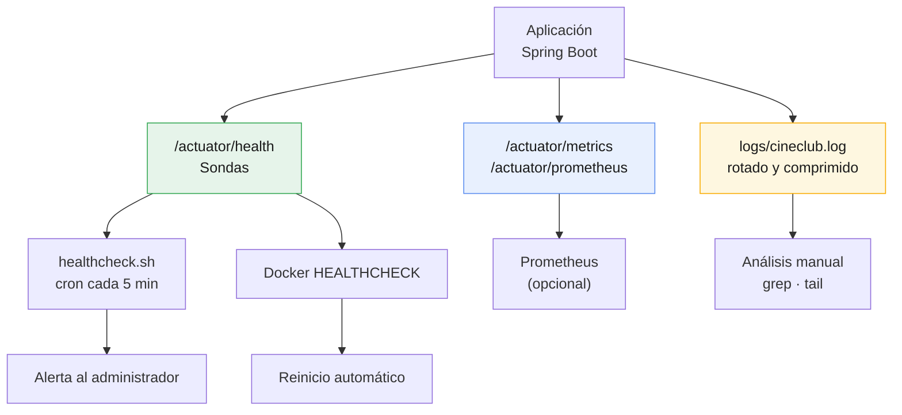

# Plan de monitoreo

Proyecto CineClub Salamanca — UTP, Curso Integrador I: Sistemas Software.

## 1. Objetivo

Monitorear no es guardar logs por las dudas. Es poder contestar tres preguntas cuando algo
falla, y ojalá antes de que el usuario se dé cuenta.

| Pregunta | Con qué se responde |
|---|---|
| ¿La aplicación está viva y puede atender? | Health tools: Actuator health |
| ¿Responde con la rapidez esperada? | Performance tools: métricas de Micrometer |
| ¿Qué pasó exactamente y cuándo? | Logs: Logback con rotación |

Los tres se apoyan en Spring Boot Actuator, que expone la telemetría por HTTP sin código
extra, y en Micrometer, que hace de fachada de métricas (el mismo código sirve para
Prometheus, Graphite o New Relic).



## 2. Health tools

### 2.1 Endpoints

| Endpoint | Acceso | Uso |
|---|---|---|
| `/actuator/health` | Público | Estado global, lo consulta el balanceador |
| `/actuator/health/liveness` | Público | ¿El proceso vive? Lo usa el HEALTHCHECK de Docker |
| `/actuator/health/readiness` | Público | ¿Puede aceptar tráfico? |
| `/actuator/info` | Público | Versión y metadatos del build |

Que `health` sea público es intencional: un balanceador no se puede autenticar. Pero con
`show-details=when-authorized` el anónimo ve solo el estado, y para el detalle de los
componentes hace falta `ROLE_ADMIN`. Contarle a cualquiera que la base está caída es
información útil para un atacante.

### 2.2 Sondas

| Sonda | Origen | Qué verifica |
|---|---|---|
| `db` | Actuator | Conectividad con PostgreSQL |
| `diskSpace` | Actuator | Espacio libre en disco |
| `ping` | Actuator | El proceso responde |
| `cartelera` | Propia | Hay funciones futuras programadas |

### 2.3 La sonda de cartelera

`CarteleraHealthIndicator` es una sonda funcional, no técnica: la aplicación puede estar
sana y ser inútil para el espectador si la cartelera está vacía.

Lo importante del diseño es que una cartelera vacía se reporta con un estado propio,
`SIN_CARTELERA`, y no con `DOWN`. Actuator traduce `DOWN` a HTTP 503, con lo que el
balanceador sacaría la instancia y Docker reiniciaría el contenedor, todo por una condición
de negocio y no por una falla. Los estados que Actuator no conoce se sirven con 200 y pesan
menos al agregar, así que el aviso queda visible sin bajar la salud global.

Esto salió de las pruebas de integración (OBS-02 del
[informe de seguridad](INFORME_SEGURIDAD.md)) y hay un test que lo fija para que no se
revierta sin querer.

Si falla la consulta a la base, ahí sí reporta `DOWN`, porque eso sí es una falla.

### 2.4 Respuesta

```jsonc
// Anónimo — GET /actuator/health
{ "status": "UP" }

// Administrador — GET /actuator/health
{
  "status": "UP",
  "components": {
    "cartelera":  { "status": "UP", "details": { "funcionesFuturas": 8 } },
    "db":         { "status": "UP", "details": { "database": "PostgreSQL" } },
    "diskSpace":  { "status": "UP", "details": { "free": 42000000000 } },
    "ping":       { "status": "UP" }
  }
}
```

### 2.5 Verificación automática

Dos consumidores con propósitos distintos:

| Consumidor | Frecuencia | Qué hace si falla |
|---|---|---|
| HEALTHCHECK de Docker | 30 s | Marca el contenedor `unhealthy`; con `restart: always` lo reinicia |
| `scripts/healthcheck.sh` en cron | 5 min | Registra en `/var/log/cineclub/health.log` y avisa por `MAILTO` |

El script devuelve 0 (UP) o 1 (DOWN o inaccesible), así que se puede encadenar con cualquier
sistema de alertas.

## 3. Performance tools

### 3.1 Endpoints

| Endpoint | Acceso | Formato |
|---|---|---|
| `/actuator/metrics` | `ROLE_ADMIN` | Lista de métricas, JSON por métrica |
| `/actuator/prometheus` | `ROLE_ADMIN` | Formato Prometheus |

### 3.2 Métricas técnicas

| Métrica | Qué indica | Umbral de atención |
|---|---|---|
| `http.server.requests` | Latencia y volumen por endpoint y código | p95 > 1 s |
| `jvm.memory.used` | Memoria del heap | > 80% del máximo |
| `jvm.gc.pause` | Pausas del recolector | > 500 ms |
| `hikaricp.connections.active` | Conexiones en uso | cerca de `DB_POOL_MAX` sostenido |
| `hikaricp.connections.pending` | Peticiones esperando conexión | > 0 sostenido |
| `system.cpu.usage` | CPU del proceso | > 85% sostenido |
| `logback.events` | Eventos por nivel | crecimiento de `error` |

`http.server.requests` está configurada con histograma de percentiles (p50, p95, p99). El
promedio engaña: una media de 200 ms puede tapar que 1 de cada 20 usuarios espera 3
segundos. El p95 refleja mejor lo que la gente experimenta.

### 3.3 Métricas de negocio

`MetricasNegocio` publica indicadores que Actuator no puede conocer:

| Métrica | Qué contesta |
|---|---|
| `cineclub.reservas.totales` | ¿Cuántas reservas acumula el sistema? |
| `cineclub.reservas.asistencias` | ¿Cuántos espectadores llegaron a la sala? |
| `cineclub.funciones.futuras` | ¿Hay cartelera publicada? |
| `cineclub.aforo.disponible` | ¿Cuántas butacas quedan libres? |
| `cineclub.usuarios.registrados` | ¿Crece la base de socios? |

Están implementadas como `MeterBinder` y no instrumentando los servicios, para que la lógica
de negocio no cambie cuando cambie el monitoreo.

La relación entre asistencias y totales es la que más sirve para la gestión, porque mide el
ausentismo. En un cineclub con reserva gratuita eso importa: reservar y no ir no le cuesta
nada al espectador, pero deja butacas vacías.

### 3.4 Consulta

```bash
TOKEN=$(curl -s -X POST http://localhost:8080/api/auth/login \
  -H 'Content-Type: application/json' \
  -d '{"email":"admin@cineclub.com","password":"admin1234"}' | jq -r .token)

# Latencia de las peticiones a reservas
curl -s -H "Authorization: Bearer $TOKEN" \
  'http://localhost:8080/actuator/metrics/http.server.requests?tag=uri:/api/reservas' | jq

# Asistencias
curl -s -H "Authorization: Bearer $TOKEN" \
  http://localhost:8080/actuator/metrics/cineclub.reservas.asistencias | jq
```

### 3.5 Prometheus (opcional)

`/actuator/prometheus` ya expone todo en el formato que hace falta. Para tener histórico y
gráficas alcanzaría con agregar Prometheus y Grafana al Compose:

```yaml
scrape_configs:
  - job_name: cineclub
    metrics_path: /actuator/prometheus
    static_configs:
      - targets: ['backend:8080']
```

No lo incluimos en la entrega porque se sale del alcance comprometido, pero la aplicación ya
está lista: es configuración, no código.

## 4. Logs

### 4.1 Configuración

| Aspecto | Valor | Por qué |
|---|---|---|
| Archivo | `${LOG_PATH:./logs}/cineclub.log` | Montado como volumen, sobrevive al contenedor |
| Rotación | Diaria o a los 10 MB | Evita archivos inmanejables |
| Compresión | `.gz` al rotar | Los logs de texto comprimen alrededor del 90% |
| Historial | 30 días | Cubre el ciclo de incidencias del cineclub |
| Tope total | 200 MB | Que los logs no llenen el disco |
| Nivel | `DEBUG` en dev, `INFO` en prod | `DEBUG` en producción es ruido y ocupa espacio |

El tope total es la protección que más importa: sin `total-size-cap`, un error en bucle llena
el disco y se lleva puestas la aplicación y la base.

### 4.2 Formato

```
2026-07-16 23:00:00.142 [scheduling-1] INFO  c.c.maintenance.TareasMantenimiento - [MANTENIMIENTO] Reporte diario 2026-07-16 — reservas emitidas: 12, funciones futuras: 8, aforo libre: 94
```

Fecha con milisegundos, hilo, nivel, clase y mensaje. Las tareas programadas escriben con el
prefijo `[MANTENIMIENTO]` para poder filtrarlas con un `grep`.

### 4.3 Niveles

| Nivel | Cuándo se usa |
|---|---|
| `ERROR` | Falla que necesita que alguien intervenga |
| `WARN` | Anomalía que se recuperó sola, por ejemplo un aforo corregido |
| `INFO` | Hitos de negocio y resultado de las tareas programadas |
| `DEBUG` | Detalle de desarrollo, apagado en producción |

### 4.4 Consultas frecuentes

```bash
# Errores de hoy
grep ERROR logs/cineclub.log

# Resultado de las tareas programadas
grep '\[MANTENIMIENTO\]' logs/cineclub.log

# Inconsistencias de aforo (posible problema de concurrencia)
grep 'Aforo inconsistente' logs/cineclub.log

# Buscar en el histórico comprimido sin descomprimirlo
zgrep ERROR logs/cineclub-2026-07-*.log.gz

# Seguir en vivo
docker compose logs -f backend
```

### 4.5 Cambiar el nivel sin reiniciar

El endpoint `loggers` permite subir el detalle durante una incidencia y bajarlo después, sin
perder el estado de la aplicación:

```bash
curl -X POST http://localhost:8080/actuator/loggers/com.cineclubsalamanca \
  -H "Authorization: Bearer $TOKEN" \
  -H 'Content-Type: application/json' \
  -d '{"configuredLevel":"DEBUG"}'
```

## 5. Indicadores y umbrales

| Indicador | Fuente | Normal | Atención | Crítico |
|---|---|---|---|---|
| Disponibilidad | `/actuator/health` | UP | — | DOWN > 1 min |
| Latencia p95 | `http.server.requests` | < 300 ms | > 1 s | > 3 s |
| Errores 5xx | `http.server.requests` | 0 | > 1% | > 5% |
| Memoria heap | `jvm.memory.used` | < 70% | > 80% | > 95% |
| Conexiones pendientes | `hikaricp.connections.pending` | 0 | > 0 | > 5 sostenido |
| Espacio en disco | `diskSpace` | > 20% | < 20% | < 10% |
| Cartelera | `cartelera` | UP | SIN_CARTELERA | — |
| Inconsistencias de aforo | Log semanal | 0 | 1 o más | 5 o más |

Estos umbrales son un punto de partida razonable, no valores medidos: todavía no hicimos
pruebas de carga (ver limitaciones del [informe de pruebas](INFORME_PRUEBAS.md)). Habrá que
recalibrarlos con datos reales de operación.

## 6. Ante una incidencia


### Diagnóstico rápido

```bash
docker compose ps                          # estado de los contenedores
./scripts/healthcheck.sh                   # ¿responde?
grep ERROR logs/cineclub.log | tail -20    # últimos errores
docker stats --no-stream                   # CPU y memoria
docker compose logs --tail=100 backend     # traza reciente
```

## 7. Responsabilidades

| Actividad | Frecuencia | Responsable |
|---|---|---|
| Sonda de salud | Automática, 5 min | `healthcheck.sh` en cron |
| Revisión de errores del log | Diaria | Responsable de operaciones |
| Revisión de métricas | Semanal | Responsable de operaciones |
| Revisión del reporte de negocio | Semanal | Coordinación del cineclub |
| Recalibrar umbrales | Trimestral | Equipo de desarrollo |

## 8. Limitaciones

1. **Sin alertas automáticas** más allá del correo de cron. Prometheus con Alertmanager
   permitiría alertar por umbral y no solo por caída total.
2. **Sin histórico de métricas.** Actuator expone el valor actual; sin Prometheus no hay
   series temporales ni comparación entre semanas.
3. **Logs solo en archivo local.** Con varias instancias habría que centralizarlos con Loki
   o ELK.
4. **Los gauges consultan la base en cada lectura.** Con más volumen convendría cachearlos,
   porque `contarAsistencias()` recorre todas las reservas.
5. **Umbrales sin validar con carga real** (ver sección 5).

## Documentos relacionados

- [Arquitectura](ARQUITECTURA.md)
- [Plan de despliegue](PLAN_DESPLIEGUE.md)
- [Plan de mantenimiento](PLAN_MANTENIMIENTO.md)
- [Informe de seguridad](INFORME_SEGURIDAD.md)
